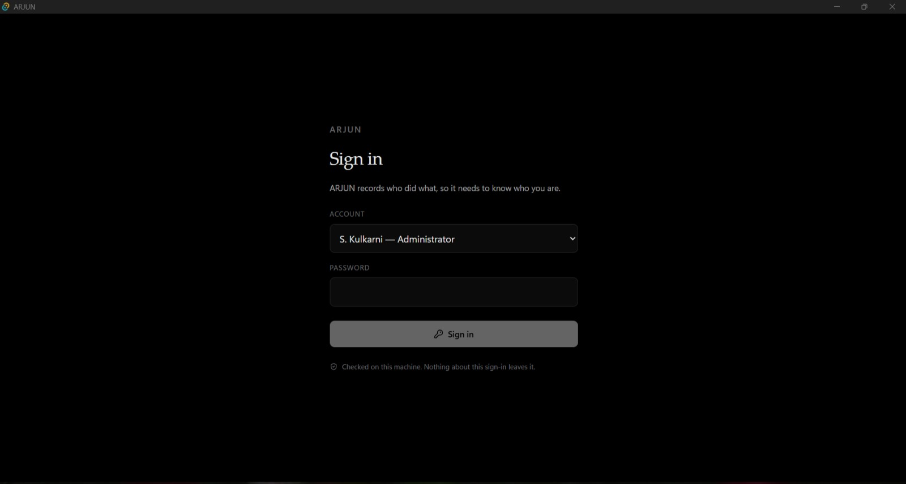
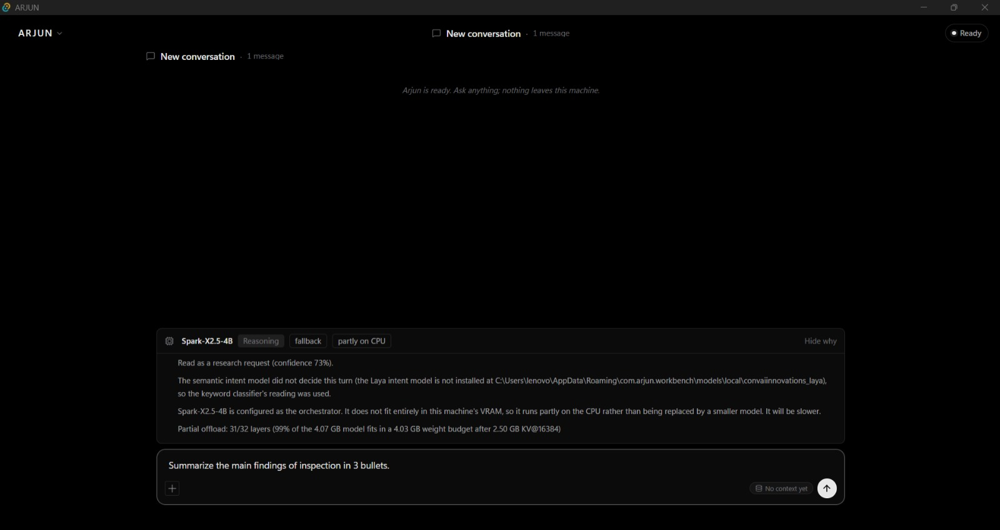
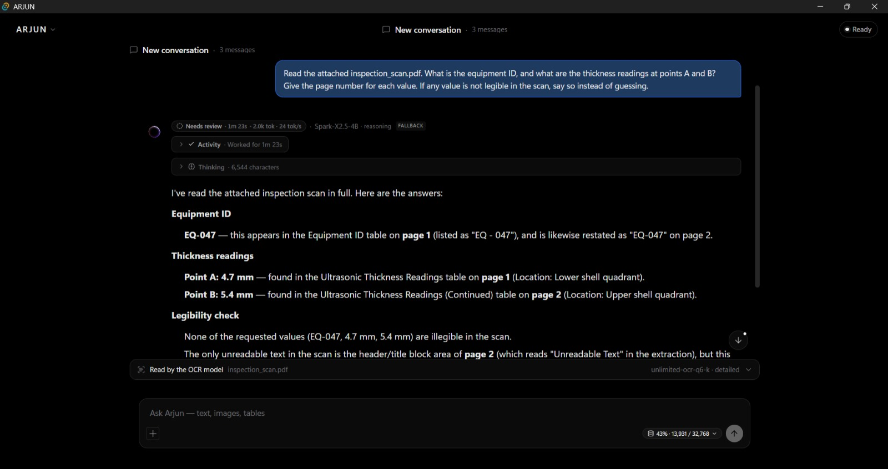
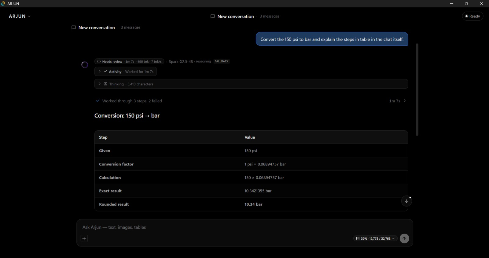
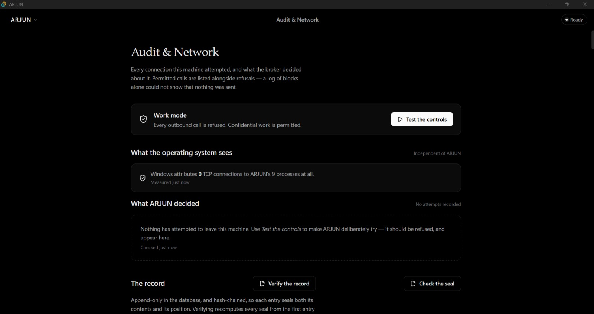
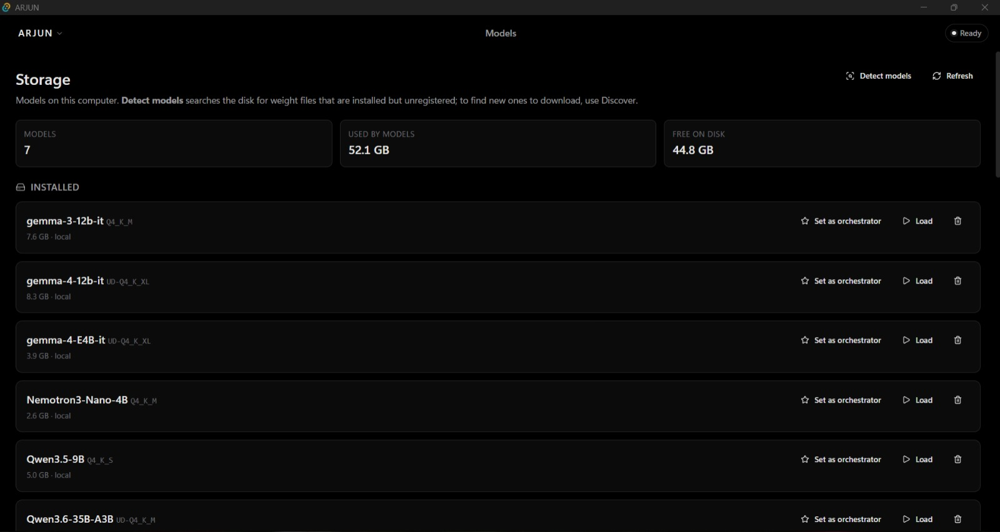
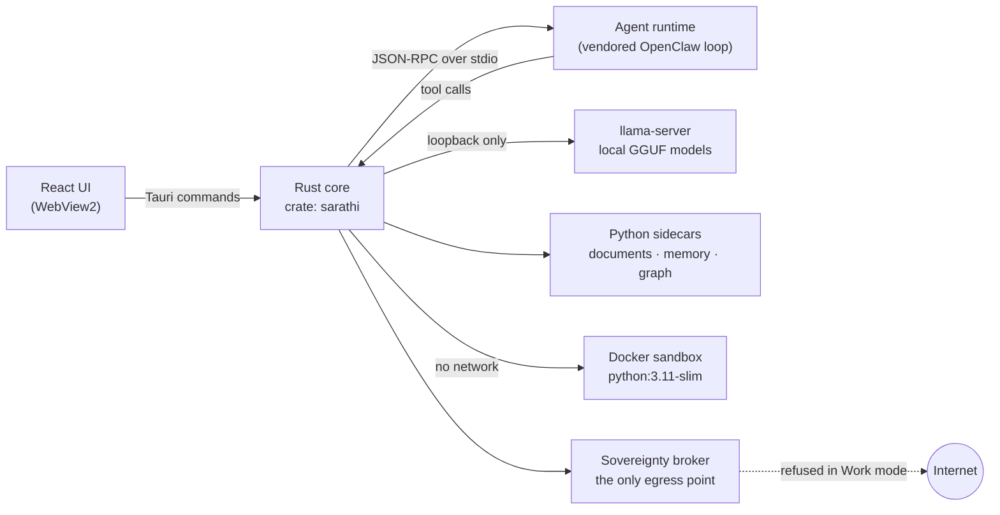

<div align="center">

# ARJUN

### A sovereign, on-premise AI workbench for confidential industrial work

Open-weight AI models running entirely on your own machine, with a build that lets you **prove**
nothing leaves it.


[Overview](#overview) · [Screenshots](#arjun-at-a-glance) · [Features](#features) ·
[How it works](#how-it-works) · [Quick start](#quick-start) · [How to use](#how-to-use) ·
[Troubleshooting](#troubleshooting)

</div>

---

## Overview

Refineries, public-sector plants and government offices produce sensitive everyday work: inspection
reports, maintenance procedures, approval notes and engineering calculations. None of it can be pasted
into a cloud AI assistant.

**ARJUN** is a Windows desktop application that brings the AI to the data instead. It runs open-weight
language models on the local GPU, reads scanned documents on the machine, carries out multi-step work
with local tools, and hands back real deliverables: Word, Excel and PowerPoint files, working code, and
calculations with their steps shown. In **Work mode** every outbound network call is refused, and the
app shows what Windows itself reports about ARJUN's connections.

Built for **Smart India Hackathon 2026, PS 26117 (MRPL)**: *"Sovereign On-Premise Agentic AI Workbench
using Open-Weight Multimodal LLMs for Confidential Industrial Work"*.

**Who it is for:** engineers and officers who work with confidential documents, IT teams who must run
AI inside an air-gapped network, and reviewers who need evidence that no data left the site.

https://github.com/user-attachments/assets/fd3218f5-c17e-4c61-984d-7a1621bcb177

<p align="center"><b>Launch video (2:30)</b>: sign-in, automatic model choice, a scanned report read
on-device, an SOP check, and an approval note written as a Word document.</p>

---

## ARJUN at a glance

<table>
<tr>
<td width="50%" valign="top">
<br>
<b>1. Local sign-in</b><br>
Secure local sign-in, verified directly on the machine.
</td>
<td width="50%" valign="top">
<br>
<b>2. Automatic model choice</b><br>
Automatically selects the appropriate local model and explains the decision before processing.
</td>
</tr>
<tr>
<td width="50%" valign="top">
<br>
<b>3. Scanned documents</b><br>
Reads scanned reports entirely on-device with page-level references.
</td>
<td width="50%" valign="top">
<br>
<b>4. Calculations</b><br>
Performs calculations step by step and provides the exact result.
</td>
</tr>
<tr>
<td width="50%" valign="top">
<br>
<b>5. Audit &amp; Network</b><br>
Shows work-mode controls, auditing, and verifies that data stays on the machine.
</td>
<td width="50%" valign="top">
<br>
<b>6. Local models</b><br>
Shows open-weight models stored and available locally on the machine.
</td>
</tr>
</table>

---

## Features

| Capability | What it means |
|---|---|
| **Picks the model for the task** | A router gives each request a role (reasoning, coding or document OCR) and chooses among the installed models by role, fit in GPU memory and preference. The reasons are shown under **Why?** before you send. |
| **Works like an agent** | Plans multi-step work, calls local tools, checks its own output, and keeps going until the deliverable exists, within a bounded step budget. |
| **Reads scanned documents** | Image-only PDFs are read page by page by an on-device OCR model; answers cite the page each value came from. |
| **Calculates, doesn't guess** | Figures come from a units-aware calculation engine, and the working steps are recorded with the answer. |
| **Produces real deliverables** | Approval notes (`.docx`), calculation workbooks (`.xlsx`), briefing decks (`.pptx`), PDFs, charts, tables and diagrams, each re-opened and checked before it is reported ready. |
| **Runs code in a sandbox** | Code runs in a Docker container with no network, a read-only filesystem, and memory, CPU and process limits. |
| **Grounds answers in your documents** | A local knowledge base of manuals, SOPs and correspondence; searches never leave the machine. |
| **Asks before it acts** | Writing a file or running code waits for a person to approve, showing the action, the target and the effect. |
| **Refuses the network** | In **Work mode** every outbound call is refused, and the Audit & Network page shows the connections Windows attributes to ARJUN's processes. |

---

## How it works

In plain terms: the window you see is a web-style interface; behind it a Rust program does the real
work. It runs the AI models on your own GPU, reads documents with small helper programs, and is the
only part of ARJUN allowed to talk to the network at all.



1. The **React frontend** calls typed services in `src/services/`, which invoke Tauri commands.
2. The **Rust core** downloads, sizes and serves models, routes each request, and supervises the
   **agent runtime** as a child process over stdio. It never opens a listening socket.
3. The runtime plans the work and calls back into the core for **tools**, each gated by capability
   grants and, where it matters, human approval.
4. Models are served by **llama-server** on loopback (`127.0.0.1`, reachable only from this machine);
   documents and memory are handled by **Python sidecars** (helper processes); code runs in a
   **network-less container**.
5. Any outbound request goes through the **sovereignty broker**, the one audited chokepoint.
6. Every run is written to an ordered, append-only history, so a window can reattach to a run and a
   restart can recover the runs it interrupted.

**Technologies:** Tauri 2, Rust, React 19 + TypeScript + Vite, llama.cpp (`llama-server`) with GGUF
models, Python sidecars, Docker (optional, for the code sandbox), WebView2.

---

## Security and privacy

"It runs offline" is easy to say. ARJUN treats it as something the build has to demonstrate.

- **One egress chokepoint.** Only `src-tauri/src/sovereignty/broker.rs` may build an outbound HTTP
  client. `npm run check:egress` fails the build if a second one appears, and every external hostname
  in the tree must be on a reviewed allowlist (`arjun-egress-ok: <reason>` documents each exemption).
- **The embedded browser is silenced.** WebView2 on its own contacts Microsoft (component updates,
  proxy auto-discovery, Microsoft sign-in). ARJUN starts it with those features off and DNS limited to
  loopback, pinned by tests. See [`docs/sih/webview2-egress.md`](docs/sih/webview2-egress.md).
- **Windows is the witness.** The Audit & Network page lists the connections Windows attributes to
  every process in ARJUN's tree (the app, the model server, the sidecars, the browser) and says
  whether any of them leaves the machine.
- **The agent loop has no cloud in it.** `agent-runtime/` vendors OpenClaw's loop with the cloud
  providers removed; `npm run runtime:audit` and `npm run check:bundle` check the source and the
  bundled artifact.
- **Local accounts, hashed passwords.** Passwords are stored only as Argon2id hashes. There is no
  password recovery by email; an administrator resets another account.
- **An SBOM ships with the evidence.** `npm run sbom` regenerates `evidence/sbom.md` and
  `evidence/sbom.cdx.json` (CycloneDX).

### Problem statement coverage

The official expected solution for PS 26117 (verbatim in
[`docs/sih/ps-26117-official.md`](docs/sih/ps-26117-official.md)) and where ARJUN meets it:

| PS 26117 asks for | In ARJUN |
|---|---|
| *"model auto selection across at least two different task types"* | The router sends a summary to a reasoning model and a coding request to a coding model, with its reasons shown ([`docs/intent-routing.md`](docs/intent-routing.md)) |
| *"An agentic task carried through end to end"* | Read a scanned inspection report, compare it with an SOP, and draft the approval note as a Word file |
| *"A coding task run and verified in a sandbox"* | `sandbox.run_code` in a Docker container with `--network=none`; the script's own asserts prove the result |
| *"A multimodal task involving image or scanned document understanding"* | On-device OCR of image-only PDFs, with page references for every value |
| *"no external calls are made at any point"* | An independent per-process monitor, ARJUN's Audit & Network page, and build-time egress gates |

Human approval, local accounts and the audit trail are **ARJUN's additions**, not requirements of the
problem statement.

---

## Quick start

### Prerequisites

| | Component | Version / notes |
|---|---|---|
| **Required** | Windows 10 or 11 | ARJUN is a Windows desktop app (WebView2) |
| **Required** | Node.js | ≥ 22.19 (enforced by `agent-runtime/package.json`) |
| **Required** | Rust | stable toolchain, plus the [Tauri prerequisites](https://tauri.app/start/prerequisites/) |
| **Required** | Python | 3.10+, for the document, memory and graph sidecars |
| **Required** | Disk space | several GB per model; the installed models in the screenshot range from 2.6 GB to 8.3 GB |
| Optional | NVIDIA GPU + CUDA toolkit, or the Vulkan SDK | GPU acceleration. The default orchestrator model needs a CUDA or Vulkan build; ARJUN is sized for 8 GB-VRAM cards |
| Optional | Docker Desktop | the code sandbox. Pull `python:3.11-slim` once while online; ARJUN never pulls images itself |

### Installation and setup

**1. Clone the repository**

```bash
git clone https://github.com/Straw-hat-Luffy26/Arjun.git
```

**2. Enter the project directory**

```bash
cd Arjun
```

**3. Install dependencies**

```bash
npm install
npm run runtime:install
```

`runtime:install` runs `npm ci --offline` for the agent runtime, so it installs only from the local
npm cache and never fetches.

**4. Configure the GPU backend**

No configuration file is needed. `npm run dev:auto` (step 6) probes the machine and picks the backend:

| Found on the machine | Backend used |
|---|---|
| NVIDIA driver **and** CUDA toolkit (`nvcc`) | CUDA |
| Vulkan SDK (`VULKAN_SDK` or `glslc`) | Vulkan |
| neither | CPU |

To force a backend, set `SARATHI_BACKEND` (`cuda`, `vulkan` or `cpu`) before running, or use
`npm run tauri:dev:gpu` / `npm run tauri:dev:vulkan` directly.

**5. Prepare local models and components**

Models are installed from inside the app (see [How to use](#how-to-use)), from **Discover**, or found
on disk with **Models → Detect models**. On a fresh configuration ARJUN uses
`lmstudio-community/gemma-4-12B-it-QAT-GGUF` (`Q4_0`) as the default orchestrator and loads it at
startup. This needs a CUDA or Vulkan build with at least one layer on the GPU; a CPU fallback is
rejected rather than reported as GPU execution.

For the code sandbox, start Docker Desktop and, while still online, pull the image once:

```bash
docker pull python:3.11-slim
```

**6. Start the application**

```bash
npm run dev:auto
```

The first run compiles the Rust core, which takes several minutes. `npm run dev` starts only the Vite
frontend, which is useful for UI work but has no backend behind it.

**7. Access the application**

ARJUN opens as a desktop window; there is no URL to visit. On first launch no account has a password
yet: sign in as the administrator account, **S. Kulkarni**, and set its password (at least 12
characters). ARJUN ships with six local demo accounts, one Administrator and five Employees.

**8. Verify that it is working**

- The status pill in the top-right corner reads **Ready** once a model is loaded.
- Ask a short question in a new conversation and click **Why?** to see which model was chosen.
- Open **Audit & Network**: Windows should report 0 TCP connections leaving ARJUN's processes.
- From the terminal, run the egress gate:

```bash
npm run check:egress
```

### Build an installer

```bash
npm run build:auto        # pick a backend and build
npm run tauri:build:gpu   # CUDA
npm run tauri:build:vulkan
```

---

## How to use

1. **Launch and sign in.** Choose your account and enter your password. Sign-in is checked on this
   machine; nothing about it leaves.
2. **Install a model.** An administrator opens **Models** to see what is installed, adds models from
   **Discover**, and can make any installed model the orchestrator with **Set as orchestrator**.
3. **Switch on Work mode.** On **Audit & Network**, Work mode refuses every outbound call. **Test the
   controls** makes ARJUN deliberately try, and the refusal appears on the page.
4. **Ask a question.** Type in a new conversation. Before sending, **Why?** shows the model ARJUN
   picked and its reasons.
5. **Attach documents.** Attach a PDF, Word, Excel or PowerPoint file. Image-only scans are read by the
   on-device OCR model, and answers cite the page each value came from.
6. **Ask for a deliverable.** For example: *"Draft the approval note as a Word file."* ARJUN plans the
   steps, uses its tools, and returns the file with a link to open it.
7. **Approve actions.** When ARJUN wants to write a file or run code, it asks first and shows what the
   action will do.
8. **Review the record.** **Audit & Network** keeps an append-only, hash-chained record of what was
   attempted and decided; **Verify the record** re-checks it.

---

## Configuration

| Setting | Where | Effect |
|---|---|---|
| Orchestrator model | **Models → Set as orchestrator** | the model that plans and answers by default |
| Load at startup | `ai_settings.auto_load_on_startup` | turn off to skip loading the orchestrator when ARJUN starts |
| GPU backend | `SARATHI_BACKEND` = `cuda`, `vulkan` or `cpu` | overrides what `dev:auto` / `build:auto` detect |
| Work mode | **Audit & Network** | refuses every outbound call |

Models and app data live under `%APPDATA%\com.arjun.workbench\`.

---

## Verify a build

`npm run verify` runs the whole chain: egress gate, offline-build check, vendor audit, typecheck,
runtime tests, runtime build, bundle gates, SBOM, and the Rust and Python suites. Run it before
shipping or reviewing.

<details>
<summary><b>The individual gates</b></summary>

| Command | What it checks |
|---|---|
| `npm run check:egress` | only the broker can make outbound calls; hostnames are allowlisted |
| `npm run check:offline` | the build completes with no network access |
| `npm run runtime:audit` | the vendored OpenClaw copy still has its cloud providers removed |
| `npm run runtime:typecheck` | types across the agent runtime |
| `npm run runtime:test` | agent-runtime unit tests (Vitest) |
| `npm run test:ui` | frontend logic tests |
| `npm run check:bundle` | inspects the built runtime artifact for surviving providers |
| `npm run sbom` | regenerates the CycloneDX SBOM under `evidence/` |
| `npm run test:rust` | Rust unit tests |
| `npm run test:integration` | agent-runtime and two-runtime integration tests |
| `npm run test:baseline` | acceptance baseline |
| `npm run test:sidecar` | Python sidecar tests |
| `npm run accept` | acceptance run against `acceptance-baseline.json` |

</details>

---

## Project structure

```
src/              React 19 + TypeScript frontend (pages, components, typed services)
src-tauri/        Rust core, crate `sarathi`
  agent_runtime/    supervises the TS runtime; planning, artifacts, context, durable run history
  orchestrator/     tools, plans, sandbox execution
  registry/         model registry and the task router
  serving/          llama-server lifecycle and admission
  ai_engine/        token budgets, continuation, OCR streaming, GGUF metadata
  sovereignty/      the egress broker, network observer, WebView2 hardening
  identity/         local accounts, roles and password hashing
agent-runtime/    vendored OpenClaw agent loop (TypeScript), cloud providers removed
sidecars/         Python sidecars: documents, memory engine, graph
scripts/          build, verification and evidence gates
docs/             design notes; docs/sih/ holds the hackathon material; docs/media/ the screenshots
evidence/         generated SBOM, test reports, visual evidence
```

---

## Troubleshooting

| Problem | What to do |
|---|---|
| The window opens but nothing answers | `npm run dev` starts only the frontend. Use `npm run dev:auto` (or a `tauri:dev:*` script). |
| The default model will not load | It needs a CUDA or Vulkan build with at least one layer on the GPU. Install the CUDA toolkit or Vulkan SDK and rebuild, or pick a smaller model under **Models**. |
| `dev:auto` chose CPU on a machine with an NVIDIA GPU | The CUDA toolkit (`nvcc`) is needed, not just the driver. Check `nvcc --version`, or set `SARATHI_BACKEND`. |
| Code runs fail | The sandbox runs only while Docker Desktop's engine is up: check `docker info`, and pull `python:3.11-slim` once while online. |
| `npm run runtime:install` fails | It installs with `--offline`, from the local npm cache only; the packages must already be in that cache. |
| Forgotten administrator password | There is no email recovery on an air-gapped machine. Another administrator resets the account; otherwise follow your site's local recovery procedure. |

---

## Documentation

| Document | What's in it |
|---|---|
| [`docs/sih/ps-26117-official.md`](docs/sih/ps-26117-official.md) | the problem statement, verbatim |
| [`docs/sih/ps-26117-traceability.md`](docs/sih/ps-26117-traceability.md) | requirement-by-requirement traceability |
| [`docs/sih/demo-script.md`](docs/sih/demo-script.md) | the demo, step by step |
| [`docs/sih/webview2-egress.md`](docs/sih/webview2-egress.md) | how the embedded browser was kept offline, and how it was verified |
| [`docs/intent-routing.md`](docs/intent-routing.md) | how requests are routed to models |
| [`docs/design-rules.md`](docs/design-rules.md) | the design rules ARJUN is built to |

---

## Contributing

Conventional commits (`feat:`, `fix:`, `refactor:`, `docs:`, `test:`, `chore:`, `perf:`, `ci:`).
Run `npm run verify` before opening a pull request. The verification gates are the point of the
project, and a change that trips one needs a reason in review, not a new exemption.

Third-party attributions are in [THIRD_PARTY_NOTICES.md](THIRD_PARTY_NOTICES.md). ARJUN does not yet
carry a license file.
