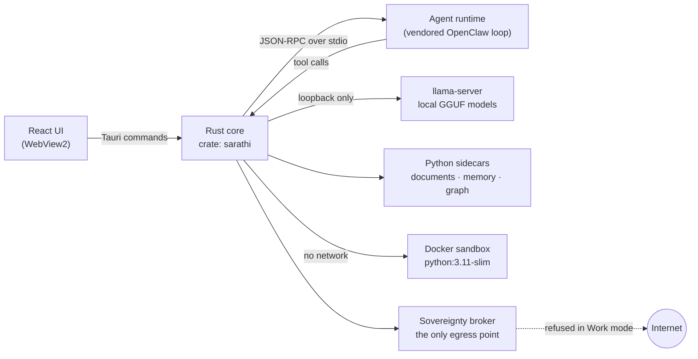

<div align="center">

# ARJUN

### A sovereign, on-premise AI workbench for confidential industrial work

Open-weight models, running entirely on your own machine — and a build that lets you **prove** nothing leaves it.


[What it does](#-what-arjun-does) · [How it works](#-how-it-works) · [Proof of no egress](#-proving-nothing-leaves-the-machine) · [Quick start](#-quick-start) · [Verify a build](#-verify-a-build) · [Docs](#-documentation)

</div>

---

## 💡 In one paragraph

Refineries, PSUs and government offices produce sensitive everyday work — approval notes, engineering
calculations, inspection reports, internal tools — that cannot be pasted into a cloud AI assistant.
**ARJUN** is a desktop workbench that gives that work an AI assistant anyway, **without the data ever
leaving the machine**. It serves open-weight models on the local GPU, picks the right model for each
task, reads scanned documents with on-device OCR, plans and carries out multi-step work with local
tools, and hands back real deliverables — Word, Excel and PowerPoint files, working code, calculations
with their steps. Every network connection it makes is visible, and the build itself checks that no
code path can reach the internet.

Built for **Smart India Hackathon 2026, PS 26117 (MRPL)**:
*"Sovereign On-Premise Agentic AI Workbench using Open-Weight Multimodal LLMs for Confidential
Industrial Work"*.

---

## ✨ What ARJUN does

| | Capability | How |
|---|---|---|
| 🧭 | **Picks the model for the task** | A router assigns each request a role — reasoning, coding or document OCR — and chooses among the installed models by role, fit in GPU memory and preference. The reasons are shown under **Why?** before you send. |
| 🤖 | **Works like an agent** | Plans multi-step work, calls local tools, checks its own output, and keeps going until the deliverable exists — within a bounded step budget. |
| 📄 | **Reads scanned documents** | Image-only PDFs are read page by page by an on-device OCR model; answers cite the page each value came from. |
| 🧮 | **Calculates, doesn't guess** | Figures come from a units-aware calculation engine, and the working steps are recorded with the answer. |
| 📦 | **Produces real deliverables** | Approval notes (`.docx`), calculation workbooks (`.xlsx`), briefing decks (`.pptx`), PDFs, charts, tables and diagrams — each re-opened and checked before it is reported ready. |
| 🧪 | **Runs code in a sandbox** | Code runs in a Docker container with **no network**, a read-only filesystem, no capabilities, and memory, CPU and process limits. |
| 📚 | **Grounds answers in your documents** | A local knowledge base of manuals, SOPs and correspondence; searches never leave the machine. |
| ✋ | **Asks before it acts** | Writing a file or running code waits for a person to approve, showing the action, the target and the effect. |
| 🔒 | **Refuses the network** | In **Work mode** every outbound call is refused, and the Audit & Network page shows what Windows itself reports for ARJUN's processes. |

---

## 🧩 How it works



1. The **React frontend** calls typed services in `src/services/`, which invoke Tauri commands.
2. The **Rust core** downloads, sizes and serves models, routes each request, and supervises the
   **agent runtime** as a child process over stdio — it never opens a listening socket.
3. The runtime plans the work and calls back into the core for **tools**, each gated by capability
   grants and, where it matters, human approval.
4. Models are served by **llama-server** on loopback; documents and memory are handled by
   **Python sidecars**; code runs in a **network-less container**.
5. Any outbound request goes through the **sovereignty broker** — the one audited chokepoint.
6. Every run is written to an ordered, append-only history, so a window can reattach to a run and a
   restart can recover the runs it interrupted.

---

## 🎯 Problem statement → ARJUN

The official expected solution for PS 26117 (verbatim text in
[`docs/sih/ps-26117-official.md`](docs/sih/ps-26117-official.md)) and where ARJUN meets it:

| PS 26117 asks for | In ARJUN |
|---|---|
| *"model auto selection across at least two different task types"* | The router sends a summary to a reasoning model and a coding request to a coding model, with its reasons shown — [`docs/intent-routing.md`](docs/intent-routing.md) |
| *"An agentic task carried through end to end"* | Read a scanned inspection report, compare it with an SOP, and draft the approval note as a Word file |
| *"A coding task run and verified in a sandbox"* | `sandbox.run_code` in a Docker container with `--network=none`; the script's own asserts prove the result |
| *"A multimodal task involving image or scanned document understanding"* | On-device OCR of image-only PDFs, with page references for every value |
| *"no external calls are made at any point"* | An independent per-process monitor, ARJUN's Audit & Network page, and build-time egress gates — see below |

Human approval, local accounts and the audit trail are **ARJUN's additions**, not requirements of
the problem statement. The demo script is in [`docs/sih/demo-script.md`](docs/sih/demo-script.md).

---

## 🔐 Proving nothing leaves the machine

"It runs offline" is easy to say. ARJUN treats it as something the build has to demonstrate:

- **One egress chokepoint.** Only `src-tauri/src/sovereignty/broker.rs` may build an outbound HTTP
  client. `npm run check:egress` fails the build if a second one appears, and every external hostname
  in the tree must be on a reviewed allowlist (`arjun-egress-ok: <reason>` documents each exemption).
- **The embedded browser is silenced.** WebView2 on its own contacts Microsoft (component updates,
  proxy auto-discovery, Microsoft sign-in). ARJUN starts it with those features off and DNS limited to
  loopback, pinned by tests — findings and verification in
  [`docs/sih/webview2-egress.md`](docs/sih/webview2-egress.md).
- **Windows is the witness.** The Audit & Network page lists the connections Windows attributes to
  every process in ARJUN's tree — the app, the model server, the sidecars, the browser — and says
  whether any of them leaves the machine.
- **The agent loop has no cloud in it.** `agent-runtime/` vendors OpenClaw's loop with the cloud
  providers removed; `npm run runtime:audit` and `npm run check:bundle` check the source and the
  bundled artifact.
- **An SBOM ships with the evidence.** `npm run sbom` regenerates `evidence/sbom.md` and
  `evidence/sbom.cdx.json` (CycloneDX).

---

## 🚀 Quick start

### Requirements

| Tool | Version | Notes |
|---|---|---|
| Node.js | ≥ 22.19 | enforced by `agent-runtime/package.json` |
| Rust | stable, 2021 edition | plus the [Tauri prerequisites](https://tauri.app/start/prerequisites/) |
| Python | 3.10+ | for the sidecars and their tests |
| Docker Desktop | optional | for the code sandbox; pull `python:3.11-slim` once while online — ARJUN never pulls |

A GPU is optional: ARJUN builds against **CUDA** or **Vulkan**, or runs on the CPU.

### Install and run

```bash
npm install
npm run runtime:install   # installs the agent-runtime workspace, offline

npm run dev:auto          # picks CUDA, Vulkan or CPU for you
npm run tauri:dev:gpu     # or force CUDA
npm run tauri:dev:vulkan  # or force Vulkan
```

`npm run dev` starts only the Vite frontend — handy for UI work, but with no Rust backend behind it.

### Build

```bash
npm run build:auto        # pick a backend and build
npm run tauri:build:gpu   # CUDA
npm run tauri:build:vulkan
```

### Models

Install models from **Discover**, or let **Models → Detect models** find GGUF files already on disk.
On a fresh configuration ARJUN uses `lmstudio-community/gemma-4-12B-it-QAT-GGUF` (`Q4_0`) as the
default orchestrator and loads it at startup; this needs a CUDA or Vulkan build with at least one layer
on the GPU — a CPU fallback is rejected rather than reported as GPU execution. An administrator can
make any installed model the orchestrator from **Models → Set as orchestrator**, and startup loading can
be turned off with `ai_settings.auto_load_on_startup`. New open-weight models are added through the
registry — no redesign needed.

---

## ✅ Verify a build

`npm run verify` runs the whole chain — egress gate, offline-build check, vendor audit, typecheck,
runtime tests, runtime build, bundle gates, SBOM, and the Rust and Python suites. Run it before
shipping or reviewing.

<details>
<summary><b>The individual gates</b></summary>

| Command | What it checks |
|---|---|
| `npm run check:egress` | only the broker can make outbound calls; hostnames are allowlisted |
| `npm run check:offline` | the build completes with no network access |
| `npm run runtime:audit` | the vendored OpenClaw copy still has its cloud providers removed |
| `npm run runtime:typecheck` | types across the agent runtime |
| `npm run runtime:test` | agent-runtime unit tests (Vitest) |
| `npm run test:ui` | frontend logic tests — run recovery from the durable record |
| `npm run check:bundle` | inspects the built runtime artifact for surviving providers |
| `npm run sbom` | regenerates the CycloneDX SBOM under `evidence/` |
| `npm run test:rust` | Rust unit tests |
| `npm run test:integration` | agent-runtime and two-runtime integration tests |
| `npm run test:baseline` | acceptance baseline |
| `npm run test:sidecar` | Python sidecar tests |
| `npm run accept` | acceptance run against `acceptance-baseline.json` |

</details>

---

## 🆕 What's new

**Late September 2026 — hardening from end-to-end rehearsals of the SIH demo, run fully offline**

- **Embedded browser egress closed.** WebView2's update checks, proxy auto-discovery and Microsoft
  sign-in are switched off and its DNS is limited to loopback; tests pin every switch
  ([`docs/sih/webview2-egress.md`](docs/sih/webview2-egress.md)).
- **Every connection has a name.** The network observer covers ARJUN's whole process tree and
  attributes each connection to the process that made it, guarding against reused process IDs.
- **Scanned tables read correctly.** OCR table cells are no longer dropped; attached documents are read
  page by page, and an empty knowledge-index result no longer claims a page is illegible.
- **Plans that finish.** Steps come from the current request only, the last four steps are held for
  the promised deliverable, and a Word field the template cannot print is refused with the real field
  names instead of being dropped silently.
- **Long document threads stay in the window.** Earlier reasoning is no longer replayed, and the tool
  catalogue is sized with the conversation already in context.
- **Steadier models.** Reasoning models get a 6,144-token thinking budget; a role's preferred model is
  used even below the coding size floor, with the reason shown; tool calls written as JSON text are
  turned into real calls; hybrid models' per-layer KV heads are read from the GGUF header.

<details>
<summary><b>Earlier engineering log (September 2026)</b></summary>

#### Shared agent memory and context
- **Chat memory bus** (`chat_memory_bus.rs`) with budget-aware truncation and deterministic token accounting.
- **Dynamic context compiler** (`context_compiler.rs`) assembling instructions, history, grounded passages and pins into a hardware-bounded window.
- **Context manifests and state commits** (`context_manifest.rs`, `state_commit.rs`) recording what each turn saw.
- **Token pins** (`pins.rs`) that compaction never evicts.
- **Model handoff** (`model_handoff.rs`, `model_transition.rs`) between the orchestrator and specialist models.

#### Multi-agent administration
- Persistent agent definitions with prompts, tool bindings, model preferences and role-based access (`src-tauri/src/agents/`).
- Agent lifecycle IPC (`commands/agent_admin.rs`, `commands/agents.rs`) and the **Agents** page (`src/pages/Agents.tsx`).

#### Knowledge and memory graph
- Real-time memory feed and store (`runtime_feed.rs`, `runtime_memory.rs`, `runtime_store.rs`).
- Graph canvas (`MemoryGraphCanvas.tsx`) with label collision avoidance (`labelGeometry.ts`) and a visual test harness (`evidence/memory-graph/`).

#### Subagents
- Supervised child loops and scheduling (`child_loop.rs`, `scheduling.rs`) streaming findings into the shared graph (`graph_io.rs`).

#### Orchestration and hardware planning
- Spark-X2.5-4B as an orchestrator candidate; a VRAM planner that reads GGUF geometry and KV-cache needs (`vram_planner.rs`); token budgeting (`token_budget.rs`); response continuation (`continuation.rs`).

#### Documents and citations
- Attachment extraction for PDF, Word, Excel and PowerPoint (`sidecars/document_sidecar/attachment_extract.py`); citations linking statements to source chunks (`EvidenceCitations.tsx`).

#### Reliability
- No console pop-ups when probing `llama-server` on Windows; a synchronous crash logger; a ratcheted lint budget; a regenerated CycloneDX SBOM.

</details>

---

## 🗂️ Project layout

```
src/              React 19 + TypeScript frontend (pages, components, typed services)
src-tauri/        Rust core, crate `sarathi`
  agent_runtime/    supervises the TS runtime; planning, artifacts, context, durable run history
  orchestrator/     tools, plans, sandbox execution
  registry/         model registry and the task router
  serving/          llama-server lifecycle and admission
  ai_engine/        token budgets, continuation, OCR streaming, GGUF metadata
  sovereignty/      the egress broker, network observer, WebView2 hardening
  agents/ subagents/ knowledge/ model_manager/ policy/ audit/ identity/ …
agent-runtime/    vendored OpenClaw agent loop (TypeScript), cloud providers removed
sidecars/         Python sidecars: documents, memory engine, graph
scripts/          build, verification and evidence gates
docs/             design notes; docs/sih/ holds the hackathon material
evidence/         generated SBOM, test reports, visual evidence
```

---

## 📖 Documentation

| Document | What's in it |
|---|---|
| [`docs/sih/ps-26117-official.md`](docs/sih/ps-26117-official.md) | the problem statement, verbatim |
| [`docs/sih/ps-26117-traceability.md`](docs/sih/ps-26117-traceability.md) | requirement-by-requirement traceability |
| [`docs/sih/demo-script.md`](docs/sih/demo-script.md) | the demo, step by step |
| [`docs/sih/webview2-egress.md`](docs/sih/webview2-egress.md) | how the embedded browser was kept offline, and how it was verified |
| [`docs/intent-routing.md`](docs/intent-routing.md) | how requests are routed to models |
| [`docs/design-rules.md`](docs/design-rules.md) | the design rules ARJUN is built to |

---

## 🤝 Contributing

Conventional commits (`feat:`, `fix:`, `refactor:`, `docs:`, `test:`, `chore:`, `perf:`, `ci:`).
Run `npm run verify` before opening a pull request — the verification gates are the point of the
project, and a change that trips one needs a reason in review, not a new exemption.

Third-party attributions are in [THIRD_PARTY_NOTICES.md](THIRD_PARTY_NOTICES.md). ARJUN does not yet
carry a license file.
