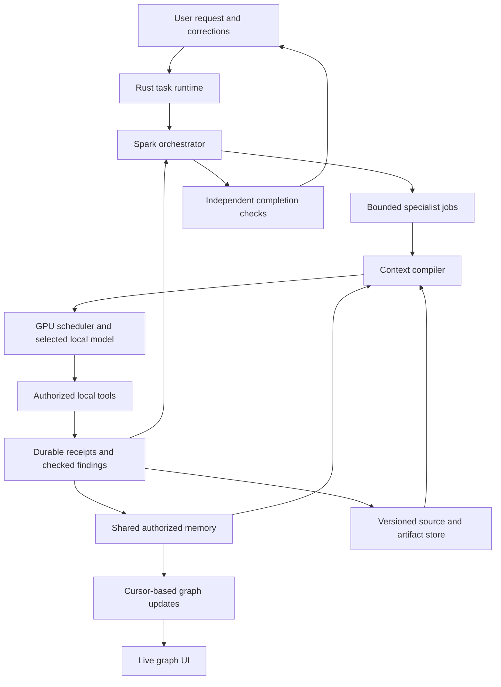

# ARJUN agent system: researched implementation plan

Date: 20 September 2026. Source baseline: `4164fc26bbdc86eeed61fcf6513f0b97f2cc7e0e`.

Quick navigation: [coding-agent master and phase prompts](#11-copy-ready-coding-agent-implementation-prompts) · [PS 26117 requirement mapping](#12-binding-alignment-with-sih-problem-statement-26117) · [offline agent definition pack](#13-offline-agent-definition-pack-and-ecc-adaptation).

This is a build plan, not an implementation or a benchmark report. Target hardware supplied by the owner: RTX 5060, 8 GB VRAM. Existing target models: Spark X2.5 4B as orchestrator, Qwen3.5 9B, Gemma 4 E4B, Nemotron Nano 4B, Gemma 4 12B, and Baidu Unlimited-OCR. Quantization policy: 8-bit around 4B; 4-bit above 4B. Target system RAM and exact Nemotron variant are not yet known. The computer accessible during this research is a different machine; its hardware is not used to size this plan.

## 1. Architecture decision

Build one durable agent runtime with nine role definitions: an orchestrator and eight specialists. All use the same authorized memory service and artifact store. Each model call receives a relevant, bounded projection of that shared state. A model is a replaceable inference engine; the agent's identity, task, memory, permissions and artifacts survive model replacement.

Keep Rust responsible for authorization, scheduling, persistence, model admission, tool execution and completion checks. Keep the React graph as a view of committed backend state. Keep model-generated text as a proposal until its evidence and output contracts have been checked.

Use the existing runtime rather than importing a second agent framework. The design borrows publicly documented patterns from OpenAI and Anthropic; it does not claim to reproduce their private internals. Their hosted APIs are research references, not production dependencies for the air-gapped deployment.



Nine logical agents do not imply nine model processes or nine simultaneous generations. On this GPU, begin with one heavy generation slot. CPU retrieval, indexing and bounded file work can overlap when RAM permits. Independent specialist jobs can queue without consuming nine contexts on the GPU.

## 2. What the research supports

| Published pattern | What to adopt in ARJUN |
|---|---|
| OpenAI distinguishes handoffs from agents-as-tools. The latter keeps the manager responsible for the answer. | Spark remains task coordinator; specialists receive bounded jobs and return structured results. Use a handoff only when ownership really changes. [OpenAI orchestration](https://developers.openai.com/api/docs/guides/agents/orchestration) |
| OpenAI separates final output, conversation history and resumable state. | A paused task remains the same task. Persist outstanding tool calls, permissions and continuation state; do not turn an interruption into a fresh task. [Results and state](https://developers.openai.com/api/docs/guides/agents/results) |
| OpenAI describes trimming and summarization, including their loss and distortion risks. | Preserve authoritative constraints separately; compact working history without replacing original logs or source files. [Session memory](https://developers.openai.com/cookbook/examples/agents_sdk/session_memory) |
| OpenAI documents deferred tool loading. | Load the small tool set needed by each role; make capability discovery local and permission-filtered. The hosted API feature is not assumed to exist in local models. [Tool search](https://developers.openai.com/api/docs/guides/tools-tool-search) |
| Anthropic describes orchestrator–worker and evaluator–optimizer patterns. | Use deterministic tools for arithmetic/rendering; use model planning where the next step is uncertain. Limit repair attempts and measure their value. [Building effective agents](https://www.anthropic.com/engineering/building-effective-agents) |
| Anthropic's research system uses separate specialist contexts and artifact references. | Share durable knowledge without copying every agent transcript into every prompt. [Multi-agent research system](https://www.anthropic.com/engineering/multi-agent-research-system) |
| Anthropic recommends just-in-time retrieval, notes and compaction. | Compile context before each model round and fetch pages or artifact regions on demand. [Context engineering](https://www.anthropic.com/engineering/effective-context-engineering-for-ai-agents) |
| Both describe evaluating traces and actual outcomes. | Score real files, sandbox results, memory retrieval and recovery; use local traces and held-out tasks before promoting changes. [OpenAI trace grading](https://developers.openai.com/api/docs/guides/trace-grading), [Anthropic agent evals](https://www.anthropic.com/engineering/demystifying-evals-for-ai-agents) |

A shared dynamic knowledge graph is an ARJUN design choice. These sources do not establish that ChatGPT or Claude internally uses this exact graph architecture, or that ordinary agent memory updates train model weights.

## 3. Current source baseline and repairs that come first

The repository already contains meaningful foundations:

| Area | Evidence in current source | Planning consequence |
|---|---|---|
| Agent registry and administrator editor | `src-tauri/src/agents/`, `src/pages/Agents.tsx` | Extend stable IDs, versioning and model bindings. |
| Specialist registration and model-driven child loops | `src-tauri/src/lib.rs:795`, `src-tauri/src/subagents/worker.rs`, `child_loop.rs` | Keep the existing delegation and permission narrowing. |
| Shared memory persistence, typed records and changefeed | `src-tauri/src/knowledge/graph/runtime_memory.rs`, `runtime_store.rs`, `runtime_feed.rs` | Repair and consolidate; do not build a disconnected second graph. |
| Per-round context compilation and manifests | `src-tauri/src/agent_runtime/context_compiler.rs`, `context_manifest.rs`; `agent-runtime/src/context-refresh.ts` | Add correctness and retrieval improvements to this path. |
| Live memory UI and agent administration | `src/components/graph/AgentMemoryPanel.tsx`, `MemoryGraphCanvas.tsx` | Reuse the existing snapshot/changefeed design. |
| Model transitions and recovery | `src-tauri/src/agent_runtime/model_transition.rs`, `resume.rs` | Test real cross-model continuation and failure rollback. |
| Word, Excel and PowerPoint creation | `src-tauri/src/agent_runtime/artifacts.rs:338`, `:756`, `:902` | Add specialist profiles and broader editing/validation; basic creation tools already exist. |
| Container code execution | `src-tauri/src/orchestrator/runner.rs:875`, `sandbox_exec.rs` | Qualify the real environment; repair stale documentation claiming all execution is absent. |

Source inspection identified specific work before promising reliable shared intelligence:

1. **Graph cursor accuracy.** `context_compiler.rs:304` reads the current snapshot, while the manifest at `:471` records the supplied graph revision. Wire the existing atomic snapshot-plus-cursor primitive, `MemoryGraph::snapshot_at` at `runtime_store.rs:946`, into context compilation. Despite its name it returns the current snapshot, not arbitrary historical rows. For exact old-revision replay, add versioned reads or retain the selected immutable items. Never label latest rows as an older snapshot.
2. **Real receipt provenance.** `subagents/worker.rs:388` publishes with `event_seq: 0`; `runtime_memory.rs:504` keeps such entries as proposals. Carry the real successful event identity, then check its tool, run, output hash and authorization before admitting an observation. A tool having run does not automatically establish every interpretation of its output.
3. **Semantic retrieval wiring.** The context compiler explicitly describes its retrieval as lexical and notes no production caller for `LocalEmbedder`. Wire a measured local embedding/reranking path before calling it semantic memory.
4. **Memory authority migration.** Existing repository evidence describes migration as copy rather than cutover. Choose an authority per record type, replay through an outbox, reconcile counts/hashes, then retire conflicting legacy write paths. A copied graph must not compete with another mutable truth source.
5. **Executable new roles.** `worker.rs:143` hardcodes five performable profiles. The schema enum currently contains extraction/retrieval/calculation/review/code. Adding Markdown alone does not implement three new writer agents. Extend dispatch, result schemas, receipts, writer delegation, capability checks and tests together.
6. **Visual identity.** `agents/mod.rs:82` has eight colors. Nine roles need an expanded accessible palette or color-plus-label/pattern combinations; preserve existing agents' colors and historical identity.
7. **Model/projector discovery.** Current scanning recognizes projector filenames starting `mmproj-`. Qualify explicit projector binding for official packages using other naming patterns; never offer image capability merely because weights were discovered.
8. **Memory sharing policy wiring.** `shared_with_task` is stored on definitions, but the profile conversion carries the scope without that flag; the current worker graph path needs an explicit policy audit. Define whether a record is private scratch, shared task evidence or promoted project knowledge, carry that policy through the packet and effective permissions, and test both allowed and denied publication. A visible setting must affect actual reads/writes.
9. **Registry versions must reach production children.** `ChildTaskPacket` has agent/model identity but lacks a definition version (`packet.rs:108`); the manager holds profile snapshots and the worker holds construction-time instructions (`worker.rs:162`). Resolve and pin the immutable registry definition on each new dispatch, and pass its instructions, tools, sharing policy and model binding into the actual child loop. Existing jobs retain their pinned version; new jobs use the promoted version. Test an administrator edit and a learning promotion by observing the next real child request, not only the saved registry row.

These are source findings, not a complete security audit. No new test suite or target-machine model run was performed during this research. The checked-in September 19 gate reports are historical evidence; they are not a fresh test result for this plan.

## 4. Model pool, scheduling and common agent contract

An agent definition includes stable ID, immutable definition version, role, instructions, allowed/denied tools, capability requirements, output schema, memory access policy, model preference/fallbacks, limits and visual identity. Runtime services choose a compatible model based on tested capabilities and available resources, not a model-written claim of fitness.

Each job receives:

- Task/run/attempt IDs, job ID, agent ID and pinned definition version.
- Objective, acceptance criteria, constraints, dependent job IDs and cancellation token.
- Authorized source/artifact IDs with exact versions; graph revision and minimum required revision.
- Input schema, permitted tools, workspace capability, resource budget and deadline.

Each result returns:

- `completed`, `partial`, `blocked`, `failed` or `cancelled`, with an explicit reason.
- Findings with evidence regions; tool receipt IDs; artifact IDs, versions and hashes.
- Proposed memory changes and the committed graph revision, if published.
- Validation results, uncertainties, missing inputs and unresolved conflicts.
- Model/runtime/template identity, timings and resource observations.

Every tool call also records tool/version, validated arguments hash, caller authority, source revisions, call/idempotency ID, status, actual event receipt, output hash and duration. Large outputs return a bounded excerpt plus a read handle. A retryable failure explains the missing prerequisite or correctable input; it never returns invented success. Set a conservative initial repair limit of two attempts per failing step and a total run budget; tune from evaluation. Use explicit cancellation and no-progress detection rather than infinite retries.

Completion is a backend decision based on acceptance checks. A specialist returning confident prose cannot mark the task complete. Children cannot grant themselves tools or spawn unbounded descendants. Generic custom profiles should declare supported capabilities; dispatch should not depend on their editable display names.

### Model allocation for the RTX 5060 8 GB

Assignments are initial candidates to test, not a measured ranking of your installed files. Exact quantization format, projector, tokenizer and runtime must be pinned together.

| Existing model | Quantization | Recommended job | Qualification note |
|---|---|---|---|
| Spark X2.5 4B | Q8 | Orchestration, concise plans, query decomposition, learning proposals | Keep the configured orchestrator. The publisher describes writing/reasoning/tools; verify actual tool calls and runtime compatibility. The repository's b10828 minimum is a local configured requirement, not a substitute for testing the selected build. [Publisher](https://huggingface.co/XHToken/Spark-X2.5-4B-GGUF) |
| Qwen3.5 9B | Q4 | Coding, complex document synthesis, spreadsheets, calculation formulation and difficult visual interpretation | Publisher documents text/image capability; the local conversion and vision projector still need qualification. Smaller served windows on 8 GB are an engineering compromise whose quality must be measured. [Publisher](https://huggingface.co/Qwen/Qwen3.5-9B) |
| Gemma 4 E4B | Q4 candidate under the >4B rule | Visual analysis and independent rendered-page/slide review; alternate writing | E4B is 4.5B effective, approximately 8B including embeddings. Its name does not imply 4B Q8 residency. [Publisher](https://huggingface.co/google/gemma-4-E4B-it) |
| Nemotron Nano 4B | Q8 | Lightweight text review, simple calculation planning, structured text extraction and small code tasks | Confirm whether this is NVIDIA-Nemotron-3-Nano-4B or Llama-3.1-Nemotron-Nano-4B-v1.1. Architecture, runtime and licensing differ. [Nano 3](https://huggingface.co/nvidia/NVIDIA-Nemotron-3-Nano-4B-GGUF), [Llama variant](https://huggingface.co/nvidia/Llama-3.1-Nemotron-Nano-4B-v1.1) |
| Gemma 4 12B | Q4 | Optional quality escalation for writing and review | Near the GPU's capacity before runtime allocations; qualify reduced context or CPU offload. It is not a required resident model for every task. [Publisher](https://huggingface.co/google/gemma-4-12B-it) |
| Baidu Unlimited-OCR | Preserve the installed variant until inventoried | Dedicated document parsing/OCR service used by Document & Vision Analyst | Current repository config has Q6_K and Q4_K_M with a shared F16 projector. This is separate from the 4B-chat-model quantization rule. Qualify the exact installed OCR package. [Publisher](https://huggingface.co/baidu/Unlimited-OCR) |

Useful size boundary: Google's official Q4_0 package listings show about 5.15 GB of E4B weights plus a 0.992 GB projector, and 6.98 GB of 12B weights plus a 0.175 GB multimodal file. Those are **disk sizes**, not total GPU requirements, and may differ from your conversions. [E4B files](https://huggingface.co/google/gemma-4-E4B-it-qat-q4_0-gguf/tree/main), [12B files](https://huggingface.co/google/gemma-4-12B-it-qat-q4_0-gguf/tree/main)

The existing chat models do not replace a retrieval embedding service. First qualify CPU `intfloat/multilingual-e5-small` (512-token chunks with the publisher's query/passage prefixes). Compare an optional bounded reranker on the actual corpus. `Qwen3-Embedding-0.6B` plus `Qwen3-Reranker-0.6B` is an alternative if RAM and latency permit; their presence and ARJUN integration are not currently verified. [E5](https://huggingface.co/intfloat/multilingual-e5-small), [Qwen embedding](https://huggingface.co/Qwen/Qwen3-Embedding-0.6B), [Qwen reranker](https://huggingface.co/Qwen/Qwen3-Reranker-0.6B)

Spark/Qwen/Gemma publisher cards list Apache-2.0; Unlimited-OCR lists MIT; the two Nemotron variants carry different NVIDIA/Llama-related terms. Store the exact weight/conversion license and revision in the model manifest. Base-model permission does not establish conversion provenance or runtime compatibility.

### GPU scheduling policy

Keep all model definitions registered, but begin with one resident heavy inference job: Spark plans → checkpoint/unload when necessary → OCR or specialist runs → commit result → Spark resumes from shared state. Batch neighbouring jobs using the same model only when task dependencies and user priority permit. Measure swap latency; minimize needless back-and-forth.

One scheduler must account for the parent, children, OCR, vision encoders, embedding jobs and background learning. Separate per-component limits can otherwise oversubscribe the same card. Admission uses current free VRAM, observed model/context/image memory, desktop headroom and system RAM, not parameter count alone. Cancelled jobs release leases; an OOM must recover without losing the task or silently lowering quantization. Co-residency is a later measured optimization, not a starting assumption.

Avoid a parent/child deadlock: checkpoint and release or suspend the parent's GPU lease before it awaits a child requiring the same capacity. The orchestration process remains alive without holding the model allocation. On return, re-acquire the parent lease and revalidate/rebind the serving endpoint before the next Spark call. Test parent → OCR → specialist → parent with timeout and cancellation at every transition; no job should wait for resources held by the job waiting for it.

Qualification states should be explicit: discovered → compatible runtime → task-qualified → approved for deployment. Test each exact model+quantization+projector+template+runtime combination for load, structured calls, task quality, memory, cancellation, compaction and cross-model continuity. Report actual served context rather than the advertised maximum. No throughput or fit claim in this plan has been benchmarked on the target machine.

## 5. Agent-by-agent build specifications

Tool names below are **proposed interfaces unless marked existing**. Existing names are drawn from `orchestrator/tools.rs`; exposing a function is not proof of target-machine readiness. All tools need typed inputs, bounded outputs, permission checks and receipts.

### 5.1 Orchestrator / Planner — Spark X2.5 4B, 8-bit

Own the user objective, dependency plan, delegation decisions and final synthesis. Keep Spark as requested, subject to production-path tool-call qualification. A scheduler may unload Spark while a specialist runs; its state remains durable.

Tools: existing `capability.search`, `memory.recall_authorized`, `agent.delegate_readonly`, `sovereignty.get_evidence`; proposed `task.plan_update`, `agent.delegate`, `agent.status`, `agent.cancel`, `artifact.manifest` and `task.request_review`. Writer delegation must pass the same Rust policy controls as direct writes. Do not broaden `delegate_readonly` silently.

Context: objective, user corrections, concise plan, pending decisions, completed-effect receipts, specialist result summaries and exact evidence references. It does not need full page images or every intermediate program output.

Memory: goal, constraints, plan state, decisions and unresolved questions. Reference specialist evidence instead of rewriting it as unqualified fact.

Build: structured plan with dependencies → bounded delegation → receipt-based state updates → independent completion gate → recovery tests. Test a scanned report-to-Word journey, a failed specialist, cancellation, and a correction arriving mid-task. Pass only when the final deliverable satisfies the original request and the trace explains each required step.

### 5.2 Document & Vision Analyst — Unlimited-OCR plus Gemma 4 E4B/Qwen3.5 9B, 4-bit

Interpret scanned/typed PDFs, handwriting, inspection photographs and engineering drawings. Separate transcription from visual inference. Never invent unreadable equipment labels or treat inferred drawing connectivity as certain.

Use existing PDF text when available. Route scanned pages to **local Baidu Unlimited-OCR** for parsing; send selected images, diagrams and ambiguous regions to Gemma E4B or Qwen3.5 for interpretation. OCR is a service within this agent's workflow, not a tenth autonomous agent. Baidu documents both image and multi-page parsing, but the name “Unlimited” does not remove local memory, output or page-batch limits. [Baidu model card](https://huggingface.co/baidu/Unlimited-OCR)

Reuse `ocr_profile.rs`, `ocr_stream.rs`, `ocr_spans.rs`, `ocr_repetition.rs` and `commands/ocr.rs`. Cache by document hash, page, crop, preprocessing settings and exact OCR package version. Preserve page boundaries and coordinates. Start with bounded page batches; validate page coverage, truncation, ordering, repeated text and unreadable areas before recording extraction as complete. A model cannot supply a calibrated confidence score merely by stating a number; prefer measured or clearly labelled heuristic indicators.

The repository's `ocr-model-registry.json` explicitly describes a third-party GGUF architecture rewrite and patched projector whose long-document behavior is unverified. Treat that as a qualification task, not a reason to discard an existing useful OCR path. Compare output against labelled pages and, where feasible, the pinned upstream reference implementation. If custom upstream code is needed, review and package it offline. Do not replace the local service with Baidu Cloud or a hosted demo.

Tools: existing `document.read_pages`, `document.search`, `media.extract_findings`, `knowledge.multimodal_retrieve`; proposed `document.render_regions`, `document.ocr_regions`, `document.extract_tables`, `document.layout_map` and `evidence.register_region`. OCR is a local tool service; the vision model reasons over selected crops and text.

Context: task-specific page regions, nearby captions, source version, coordinate system, OCR confidence and requested fields. Avoid loading a whole scanned manual into one multimodal call.

Output: typed entities/findings with page and bounding-box references, original units, confidence/uncertainty and unreadable regions. Store the original image or PDF hash and extraction tool/model version.

Build: page ingestion/region IDs → local OCR → multimodal model endpoint/projector test → evidence-backed extraction → graph publication. Evaluate on typed scans, skewed pages, handwriting, tables, photos and P&IDs. Measure field extraction and citation-location correctness separately; mark unsupported drawing claims unresolved. Promote verified observations, not every generated description.

### 5.3 Knowledge Retriever — local embedding/reranking tools; small LLM only when useful

Retrieve passages from SOPs, manuals, correspondence, task memory and permitted notebook sources. An embedding model is not a conversational agent; deterministic retrieval may finish a simple job without an LLM round.

Tools: existing `knowledge.search_authorized`, `knowledge.load_evidence_region`, `knowledge.multimodal_retrieve`, `memory.recall_authorized`; proposed `knowledge.hybrid_search`, `knowledge.rerank`, `memory.neighbours` and `knowledge.source_version`. Use Spark or a qualified Nemotron 4B for query decomposition only when it improves measured retrieval.

Context: question, project/notebook scope, key entities, date/version constraints and compact result candidates. Every search must filter authorization before scoring and graph expansion.

Output: ranked evidence records with source/version/page or row, short excerpt, retrieval method and unresolved coverage. Memory stores source references and search coverage, not an invented answer to an empty search.

Build: retain lexical baseline → wire local embeddings → combine lexical/vector candidates → rerank → expand a bounded graph neighbourhood → evaluate citations and access filtering. Measure Recall@k and source accuracy against human-labelled queries. Include revoked sources, stale revisions, contradictory SOPs and no-answer questions.

### 5.4 Document Author — Qwen3.5 9B, 4-bit

Produce Word approval notes and reports from accepted evidence and templates. Add `document-author` as an executable writer profile, with a typed document result.

Tools: existing `artifact.create_approval_note`, versioned artifact read/list, evidence reads; proposed `document.template_list`, `document.compose`, `document.patch_section`, `document.render_pages` and `artifact.validate_document`. Reuse current creation code and template protections. Formatting libraries do the layout; the model supplies structured content.

Context: document specification, audience, mandatory sections, evidence, approved calculation results and template version. Exact file revisions remain outside the prompt and are fetched by ID.

Memory: artifact lineage, section-to-source links, validation results and unresolved content gaps. Keep draft status until the configured approval workflow establishes otherwise.

Build: structured content schema → citation insertion → artifact registration → rendered page review → bounded correction. Test missing inputs, long tables, page breaks, header/footer preservation and editing one requested section without changing unrelated content. Success requires a reopened DOCX and rendered-page checks, not merely a successful create call.

### 5.5 Presentation Creator — Qwen3.5 9B, 4-bit

Create PowerPoint decks from a brief and evidence. Add `presentation-creator` with a slide-deck output schema. Gemma 4 12B, 4-bit, is an optional quality experiment only after memory and latency qualification.

Tools: existing `artifact.create_briefing_deck` and chart/diagram creation; proposed `slides.storyboard`, `slides.render`, `slides.inspect_layout`, `slides.patch`, `slides.export` and `artifact.validate_presentation`.

Context: audience, speaking time, message per slide, template, chart data, evidence references and thumbnails for only the slides being edited. Use structured slide specifications instead of generating arbitrary drawing code by default.

Memory: slide-to-evidence links, chart dataset versions, layout revisions and review findings.

Build: storyboard → data-backed visuals → PPTX creation → render every slide → inspect overflow/overlap/readability → revise affected slides. Tests should include dense tables, unusually long labels, contradictory source figures and updating one slide while retaining all other versions. Actual PPTX reopening and rendered QA are required.

### 5.6 Spreadsheet Analyst — Qwen3.5 9B, 4-bit

Read and create workbooks, transform tables, write formulas and produce transparent calculations. Add `spreadsheet-analyst` with a workbook result schema.

Tools: existing `artifact.create_calculation_workbook`, `calculation.evaluate_with_units` and chart creation; proposed `spreadsheet.inspect`, `spreadsheet.read_range`, `spreadsheet.write_range`, `spreadsheet.set_formula`, `spreadsheet.recalculate`, `spreadsheet.check_formulas`, `spreadsheet.diff` and `artifact.validate_workbook`.

Context: sheet schema, named ranges, sample rows, required formulas, units and relevant cells. Keep large tables in files; query ranges instead of turning an entire workbook into prompt text.

Memory: dataset lineage, formula assumptions, calculation receipts and workbook versions. Formula text, cached value and recalculated value are distinct fields.

Build: structured workbook access → formula writes → real recalculation engine → deterministic checks → renderer/reopen validation. Do not call writing formulas recalculation. Pin and package an offline calculation engine; qualify the selected library/office engine during implementation. Test broken references, circular formulas, unit mismatches, hidden-sheet dependencies and preservation of unrelated cells.

### 5.7 Calculation Analyst & Checker — qualified Nemotron Nano 4B, 8-bit

Translate a question into explicit equations, retrieve authoritative inputs, use deterministic calculation and check the result. Qwen3.5 9B is a fallback for interpretation. The model never supplies the authoritative numeric answer from mental arithmetic.

Tools: existing `calculation.evaluate_with_units` and source search; proposed `calculation.validate_dimensions`, `calculation.solve`, `calculation.compare` and `calculation.sensitivity`. Only expose solver families whose assumptions and numerical limits have been tested.

Context: equation, input source IDs, units, uncertainty, design standard/version when supplied, and calculation-engine capabilities. If an engineering criterion is missing, preserve that gap instead of inventing it.

Output: inputs → equation → substitutions → result → rounding/unit rule, with a check result and evidence references. Save input and engine versions so later agents reproduce the same numbers.

Build: expand supported formula set based on the demo tasks → dimension checking → calculation trace → independent recomputation. Test unit conversions, boundary values, invalid domains and uncertain inputs. Domain experts must validate engineering acceptance criteria before results are used operationally.

### 5.8 Coding & Testing Agent — Qwen3.5 9B, 4-bit

Implement bounded programs, run them and repair actual failures. Keep `code-worker`; reconcile its stale Markdown instructions with the current backend. A model good at general chat is not automatically qualified for tools or code repair.

Tools: existing `workspace.read_text`, `workspace.write_text`, `sandbox.run_code`, artifact reads; proposed `workspace.list`, `workspace.apply_patch`, `sandbox.run_tests`, `sandbox.read_logs`, `sandbox.collect_artifacts` and `code.static_check`.

Context: functional spec, approved input/output examples, dependency manifest, relevant code and concise test failures. Fetch file regions and logs on demand.

Memory: commit/file hashes, exact test commands and receipts, failure signatures, repair attempts and verified artifacts. A source file plus intended behavior is not a successful execution result.

Build: provision pinned offline runtime images → run a harmless program through the real production driver → add file/project and test support → bounded repair loop → replay/cancellation tests. Current source supports Python and JavaScript container execution; broader languages are additional work. No runtime downloads, host credentials, unrestricted mounts or internet access. An unavailable container must return a truthful blocked result.

### 5.9 Deliverable Reviewer — qualified Nemotron Nano 4B, 8-bit; vision-capable alternate for visual QA

Review evidence and outputs independently of the author. Use Gemma E4B or Qwen vision for rendered pages/slides if the selected Nemotron variant is text-only. Different model families can reduce shared blind spots but do not establish independence of truth; deterministic checks remain decisive.

Tools: existing artifact verification, artifact read, workspace read and source search; proposed format-specific validators, `artifact.render`, `artifact.diff`, `citation.verify`, `sandbox.read_test_report`, `calculation.replay` and `review.record`.

Context: original acceptance criteria, immutable candidate artifact, source manifest, receipts and tests. Start blind to the author's self-assessment; inspect the output first, then examine rationale if needed. Reviewer has no authoring permissions.

Memory: findings linked to exact artifact versions, severity, evidence and resolution status. Re-review the new version after any repair; never reuse an old pass for changed bytes.

Build: deterministic validators → rubric-based review → repair request contract → regression set. Inject known defects: wrong units, unsupported claims, broken formulas, clipped text, missing sections and failed tests. Record which defects were detected and which were missed.

## 6. One shared memory, with trustworthy graph updates

### Storage responsibilities

Use one canonical memory domain per deployment, backed by existing local storage. Keep four kinds of state distinct while linking them:

| State | Purpose |
|---|---|
| Durable event log | Ordered tool actions, outcomes, corrections and recovery history. |
| Memory records and relationships | Facts, constraints, decisions, plans, open questions, procedures and provenance. |
| Immutable source/artifact blobs | Exact PDFs, images, code, tables and generated files at named versions. |
| Disposable indexes and UI projections | Full-text/vector indexes and the live graph view; rebuildable from authoritative state. |

Agents share authorized task knowledge. Private scratch work can remain local to a job; useful findings become visible to peers after commit. Task sharing does not grant access to other users' confidential projects. Project-wide reuse follows the deployment's existing promotion policy.

Derived records inherit the restrictive combination of their inputs' permissions and classification. This applies to OCR spans, summaries, graph assertions, procedures and generated files. Giving a record task scope cannot widen its audience. Broader reuse requires the deployment's explicit declassification/promotion policy; removing a source link is not a permission change.

### Required memory record

Extend existing types rather than create parallel structures. Record ID, kind, subject/entity, content, source/artifact version, page/region, owner agent, model/runtime identity, task/run/attempt IDs, actual tool receipt, author, classification/ACL, status, revision, content hash and timestamps. Add validity/expiry and evaluation links where needed. Record learning candidates as a separate typed status/domain rather than ordinary established facts.

Preserve the distinction between **the source says X**, **a tool measured X**, **the model inferred X**, and **a user supplied X**. Corroboration raises evidence status; repeating a claim or assigning high confidence does not.

Use existing supports, contradicts, supersedes, derived-from, cites, part-of and answers relationships. Add artifact dependency/validation and learning relationships through a versioned schema migration. Protect both edge endpoints with authorization; counts and graph metadata must not leak hidden records.

### Commit-to-graph sequence

1. Tool finishes and its durable receipt is written. A model finding enters as a proposal.
2. The memory service checks evidence, policy, expected revision and schema.
3. In one graph transaction, persist the record/version, edges and changefeed/outbox row.
4. Publish a delta containing cursor, operation, record IDs and visible revision after commit.
5. UI applies authorized deltas; reconnect resumes from its cursor. Gaps or expired cursors trigger a fresh snapshot with an atomic cursor.
6. Dependent agents refresh context at the next model boundary or wait for a required revision before starting.

Do not depend on cross-database atomic transactions. Use durable outbox/replay with stable event IDs and idempotent consumers to bridge the task event store and graph. A crash between stores must produce eventual reconciliation, not duplicated facts or fictional completion.

Conflicting writes must produce a conflict or retry against a new revision. A correction supersedes the older record with a visible link. Descendant artifacts and cached answers whose inputs changed become stale and require revalidation. Revocation/tombstoning must invalidate retrieval caches and subsequent context; sensitive in-flight work should stop at a safe boundary.

Recheck dependencies and current authorization immediately before publishing an artifact or accepting completion. A correction or revocation may arrive during a long model/tool call; optimistic revision checks on its output record alone do not detect stale inputs. Record the source-version dependency set, then withhold publication or mark the result stale until it is recomputed/reviewed against the new inputs.

### Graph experience

Show agent, task, evidence, fact, decision, calculation, artifact and open-question nodes with type/owner/status filters. Keep color stable for agent ownership; use labels and shapes as well. Clicking a node reveals exact evidence, provenance, status, version and readers. Display proposed versus established, contradicted, superseded and stale states distinctly.

Render committed semantic events, not token-by-token reasoning. Preserve node positions during deltas; cluster dense regions and expand on demand. Do not promise zero edge crossings for arbitrary graphs. A provisional responsiveness target is p95 under one second from backend commit to visible update under a declared workload; measure the entire path. Existing frontend-only timing is not that measurement.

## 7. Context management: the mechanism between memory and a model

Shared memory is the durable library. Context is the small working packet a model receives now. Each role can query the same authorized facts while receiving different relevant packets.

Extend the current task-only graph read with explicit scope composition: current task evidence/state, authorized project knowledge, relevant user preferences and activated procedures. Apply ACL filtering independently to each scope, then precedence and applicability rules. Runtime policy and the current user request govern behavior; older preferences/procedures must not override them. Exclude expired, superseded or inapplicable lessons. Record each selection's scope and reason in the manifest. This is the read path that makes accepted cross-task improvements usable rather than merely stored.

### Before every model call

1. Freeze agent definition, model/template identity, task scope and an atomic graph snapshot/cursor.
2. Load mandatory objective, user constraints/corrections, pending approvals, current plan and completed-effect receipts.
3. Add the role's instructions and small authorized tool catalogue. Load skill details only when selected.
4. Retrieve relevant memory/evidence using authorization-filtered lexical and vector search, reranking and bounded graph expansion.
5. Attach compact recent tool results, artifact references and the recent conversation needed to understand the request.
6. Count the **fully rendered request**, including tool schemas, images, framing and reserved generation. Reject or compact before sending if it does not fit.
7. Persist a manifest with selected IDs/versions/hashes, actual graph revision, omissions/reasons, tokenizer/template and token budget.

Use `C = min(model supported window, server configured window, target-machine validated window)`. The optional-content budget is `C - generation reserve - tool schemas - framing/images - safety reserve - mandatory content`. Never allocate from advertised maximum context alone.

Initial experiments: 8K context for small routing jobs, 16K for evidence-rich specialist tasks, and larger windows only when measured quality and residency justify them. Example for a 16,384-token call: reserve 3,072 output, 1,536 schemas, 512 framing and 1,024 safety, leaving 10,240 for instructions, mandatory state, evidence and history. These are proposed starting budgets, not measured capacities. Multimodal requests require measured image accounting and may leave substantially less room.

### Compaction and long-running work

Trigger compaction before the next call would consume the safe input budget. Keep recent complete tool-call/result groups. Preserve objectives, identifiers, hard constraints, user corrections, pending approvals, unresolved questions and side-effect receipts verbatim or as verified structured records. Summarize older exploratory discussion with source/event ranges and an explicit omissions list.

Original logs remain available. Exact code/diagrams/documents live in immutable artifacts; a summary cannot recreate their bytes. If the mandatory packet alone exceeds budget, split the job or select a qualified larger-context configuration; never silently drop constraints. Treat memory text and retrieved documents as data, not instructions. Do not store private chain-of-thought as a shared memory requirement; store concise decisions, evidence and outcomes.

### Model switch or process restart

Pause at a safe tool boundary → settle/cancel pending work → persist job state and artifact references → release the previous model if required → validate the new model/runtime → compile from the same task and memory using the new tokenizer/template → resume.

KV caches and opaque provider compaction objects are not portable memory between models. OpenAI's documented compaction item is opaque; ARJUN needs its own portable state/evidence contract. [OpenAI compaction](https://developers.openai.com/api/docs/guides/compaction)

Acceptance must switch between actual distinct local models after a correction and a completed file write, then restart the process. Verify the correction is retained, references still resolve, no completed write repeats, and unfinished work completes. A mock endpoint or same-model summary test is insufficient.

## 8. Self-improvement that can be measured and rolled back

Start with memory, procedures, prompts, routing and tool ergonomics. Do not reintroduce LoRA/adapters or imply that saving memory updates model weights. Weight training is a separate future decision and unnecessary for this plan.

Three improvement loops:

1. **Within a task:** detect an actual failure, inspect evidence, revise and retry within a bounded budget. Stop repeated identical failures and report the unresolved issue.
2. **Across tasks:** capture a candidate lesson with the failed/successful trace, applicable conditions, source versions and expiry. Retrieve accepted lessons only when relevant.
3. **Across releases:** propose a versioned prompt/skill/tool-description/router change, run development and held-out evaluations, then promote or reject with rollback available.

Implement a local maintenance workflow, not an always-running tenth large model. Suggested interfaces: `learning.capture_candidate`, `evaluation.run_suite`, `evaluation.compare`, `learning.promote_version`, `learning.rollback`. The optimizer cannot alter protected graders, acceptance criteria, security policy, source evidence or model permissions.

A candidate records the problem, hypothesis, change, applicability, baseline version, evaluation dataset version, results and rollback target. State progresses from proposed → evaluated → eligible → activated or rejected. The graph can show the supporting runs and why a procedure was adopted.

Use deterministic checks first, independent model grading for appropriate semantic quality, and human/domain review where required. Keep development, validation and final hold-out sets separate; repeated optimization against the same hold-out contaminates it. Freeze grading rules before running candidates. Evaluate multiple trials to expose unstable success, not just one lucky run.

Also isolate evaluation memory. Each trial starts from a frozen, authorized memory/artifact snapshot in its own namespace. The optimizer and evaluated agent cannot read held-out answers, grader traces or lessons from earlier held-out trials. Disable promotion from evaluation runs into production memory and reset trial state between candidates. Dataset splitting alone does not prevent leakage when agents share a persistent graph. Aggregate released metrics may inform promotion; protected test content must remain inaccessible.

Measure per role: task success, citation correctness, false completion, invalid tool arguments, repair attempts, latency, peak RAM/VRAM, load/swap time and regressions. An apparently faster configuration that drops constraints is not an improvement. Promote only when predefined thresholds and non-regression gates pass; preserve old versions and support rollback on later failures. This is a design requirement, not a guarantee that every cycle improves performance. [OpenAI skill evals](https://developers.openai.com/blog/eval-skills), [Anthropic tool improvement](https://www.anthropic.com/engineering/writing-tools-for-agents)

| Agent | Example improvement candidate | Evidence needed before reuse |
|---|---|---|
| Orchestrator | A better decomposition or fewer redundant model swaps | Higher completion consistency without omitted steps or excessive latency. |
| Document & Vision Analyst | A crop, deskew or page-batching strategy for a document family | Better labelled extraction/coverage without changing the source or hallucinating fields. |
| Knowledge Retriever | Query synonyms or a better hybrid/reranking configuration | Higher retrieval recall and correct citations, including no-answer and denied-source cases. |
| Document Author | A template/section instruction that fixes repeated formatting failures | Reopened/rendered files pass layout and content preservation tests. |
| Presentation Creator | A slide layout rule that reduces overflow | Measured defect reduction across unseen slide content, preserving evidence. |
| Spreadsheet Analyst | A formula recipe or validation rule | Recalculated results pass independent numerical tests and preserve unrelated cells. |
| Calculation Analyst | A verified units/assumption checklist | Independent calculation cases pass; source-specific values never become global constants. |
| Coding & Testing Agent | A repair procedure for a recurring toolchain failure | Hidden functional tests pass; sandbox and dependency boundaries remain intact. |
| Deliverable Reviewer | A new defect detector or review rubric | Better detection on seeded unseen defects without unacceptable false positives. |

All nine can contribute candidates to this same service. Reusing a lesson retains its original access restrictions; generalization must remove confidential details before any broader promotion. A user correction to one task is not automatically an organization-wide preference or engineering rule.

## 9. Implementation sequence and acceptance gates

| Phase | Concrete work | Exit evidence |
|---|---|---|
| 0 — Inventory and baseline | Exact model files/hashes/quantization, RAM, runtime versions, projectors, offline images; baseline each role on production driver. | Machine-readable inventory and failures marked blocked/unmeasured, not invented scores. |
| 1 — Repair shared-state correctness | Snapshot/cursor contract, receipt linkage, authority cutover, revocation/invalidation, effective memory policy and per-dispatch registry version binding. | Two agents exchange an evidenced fact, see a correction, recover after a crash and cannot read an unauthorized source; the next child uses a newly saved definition while an active child retains its pin. |
| 2 — Context and GPU scheduling | Accurate rendered token accounting, role packets, compaction, model leases/eviction, pause/resume. | Spark → Qwen → reviewer → Spark with real models; no OOM and no lost constraints or repeated effects. |
| 3 — Retrieval and vision | Local embeddings/reranker, multimodal/projector qualification, evidence regions and citations. | Labelled retrieval/scan test set, actual missing-source handling, denied-source tests. |
| 4 — Finish the first end-to-end agent chain | Orchestrator, extraction, retrieval, calculation, Word author and reviewer. | Scanned inspection report → sourced findings → checked calculation when requested → reopened Word approval note → graph reflects evidence and artifact lineage. |
| 5 — Coding and sandbox | Reconcile profile; provision offline runtime; code/test/repair and cleanup. | Real program plus hidden functional tests; blocked network/host access observed; honest refusal when sandbox unavailable. |
| 6 — PowerPoint and Excel specialists | Typed result schemas, writer dispatch, format tools, recalculation/renderers, validators. | Reopened PPTX/XLSX, rendered slides, recalculated formulas, preserved unrelated content. |
| 7 — Graph/admin completion | Nine stable visual identities, model/readiness status, event cursor recovery, stale/conflict views. | Backend-to-paint latency under stated load; disconnect/reconnect and access revocation journeys. |
| 8 — Learning workflow | Versioned candidates, evaluation datasets, promotion policy, rollback and graph links. | One improvement accepted on measured evidence, one regression rejected, one rollback demonstrated. |
| 9 — Installed/offline acceptance | Package models/runtimes/templates/fonts/images; replay journeys on target deployment with external network monitoring. | Installed build completes representative tasks with measured zero external traffic and restart recovery. |

Phase 1 is the dependency for trustworthy shared learning; phase 2 is the dependency for reliable multi-model operation. Deliver one narrow, verified report-to-Word chain before expanding all formats. Parallelize independent tool implementations only after common contracts stabilize.

Start evaluation with roughly 20–30 curated tasks per specialist plus multi-agent journeys, then expand with real failures. These are proposed initial test-set sizes, not statistically established sufficiency. Include adversarial source instructions, source deletion, stale facts, ambiguous units, denied permissions, tool timeouts and bounded-resource failures.

## 10. Required demonstration journeys

1. **Shared knowledge:** vision agent extracts a finding; retriever cites a SOP; calculation agent computes; author uses those exact versions; reviewer verifies; graph displays the full chain.
2. **Correction propagation:** user corrects an input; old fact remains superseded; dependent artifacts become stale; the next agent uses the correction and regenerates affected outputs.
3. **Cross-model continuity:** model change plus process restart preserves task identity, pending work, artifact bytes and permissions.
4. **Dynamic graph recovery:** disconnect UI during commits, reconnect and recover every authorized change exactly once without duplicate nodes.
5. **Genuine coding:** code executes in the local sandbox and passes tests; a deliberately failing program is shown as failed rather than described as successful.
6. **Learning:** a recurring error produces a scoped lesson; a candidate version improves held-out results and survives regression tests; an inferior candidate is rejected.
7. **Sovereignty:** demonstrate real tasks with no external calls, including telemetry, model loaders, package/image pulls and crash reporting. Process/network observation must cover child processes too.

SIH26117 asks for capabilities and demonstrable outcomes, not nine named agents. This role structure is the proposed implementation architecture. The official requirements remain [PS 26117](https://sih.gov.in/sih2026PS) and the checked-in verbatim copy at `docs/sih/ps-26117-official.md`.

## 11. Copy-ready coding-agent implementation prompts

These prompts authorize implementation when you give them to a coding agent. They are not a claim that implementation has happened. Use the master prompt for sustained execution, or copy one phase prompt into a fresh coding session with this plan available. Each phase explicitly reads the common contract below so it does not depend on conversation history. The nine role prompts are P05–P13; the other prompts build their shared services and verify integration.

### 11.1 Common implementation contract — applies to every prompt

**Project and scope.** Work in the selected ARJUN checkout. Read the applicable `AGENTS.md`, this plan, current source, and the execution ledger before edits. The stack is Tauri/Rust, React/TypeScript, the existing Node agent runtime, and local sidecars. Revalidate historical findings at current HEAD. Preserve unrelated changes, existing agent IDs, conversations, artifacts and memory. Reuse working components. New function names in this plan are proposals: choose one canonical implementation and retain supported aliases where necessary.

**Official requirements.** Read `docs/sih/ps-26117-official.md` and the binding mapping in §12 before every phase. Preserve all applicable PS-A–PS-K conditions, record evidence against them, and distinguish official requirements from the user's graph-memory/self-improvement additions. A phase cannot waive an official requirement to simplify implementation.

**Target.** RTX 5060 8 GB VRAM; Spark X2.5 4B Q8 orchestrator; Qwen3.5 9B Q4; Gemma 4 E4B qualified at Q4; Nemotron Nano 4B Q8 after exact variant discovery; Gemma 4 12B Q4 as optional escalation; local Baidu Unlimited-OCR at its inventoried configuration. The coding computer may be different. Do not silently change quantization or claim GPU measurements from another machine. Preserve model swapping, one-heavy-generation scheduling, model-independent memory and local-only operation. No LoRA/adapter reintroduction or cloud inference dependency.

**Implementation means the full path.** For each feature, wire registration → capability discovery → model-visible schema → Rust authorization → dispatcher → real handler → durable receipt → typed result → memory/artifact registration → UI where applicable. Updating only Markdown, a tool enum, a configuration row or a mocked handler is incomplete. New agents must actually execute their pinned registry definitions through the production driver.

**Concrete integration map.** Inspect Rust `orchestrator/tools.rs` (enum, catalogue, aliases, schemas, limits, read/write/evidence metadata), `gateway.rs`, `runner.rs` **and** `agent_runtime/mod.rs` (existing artifact interception), `agent_runtime/tool_policy.rs`, `events/idempotency.rs`, recording and completion. Keep `agent-runtime/src/{catalogue,tool-names,tools}.ts`, catalogue conformance tests and `src/services/toolNames.ts` aligned. Only new UI commands also need `commands/*`, `lib.rs` handler registration, `ipc-manifest.json` and frontend services/types. Existing writer tools bypass the fallback runner through the runtime artifact path: test that real path, not only a direct creator helper.

**Tool contract.** Validate every tool argument at the backend boundary. Derive actor, project, grants, classification and workspace authority from the authenticated run, not model arguments. Use authorized IDs and immutable revisions, bounded page/range/log reads, deadlines, cancellation, idempotency for effects and sanitized error codes. Persist the actual receipt and output hash; model confidence never grants authority or establishes success. Large outputs use a scoped handle plus a bounded excerpt. Partial results identify omissions. A read-only reviewer cannot obtain writer privileges through an alias or child call.

**Data contract.** Shared memory includes record/version IDs, task/agent/model attribution, actual source/tool evidence and inherited access restrictions. Context manifests record the snapshot actually read. Corrections, revocation and stale dependencies must reach retrieval, context, graph and completion checks. Agent definition/model/skill changes affect new jobs; active jobs retain pinned versions except an explicit safe transition. Durable artifacts preserve exact bytes and lineage across turns, agents, model changes and restarts.

**Engineering workflow.** Write focused regression/contract tests for behavior being changed, then implement and run the relevant checks. Prefer small cohesive patches. If delegating, assign ownership and keep shared registration/schema changes serialized; do not revert others' work. Use available Rust, TypeScript, Python, security and UI review capabilities appropriate to changed code. If optional gstack tools are missing, use equivalent checks without installing them. Record dependency licenses/versions and include offline provisioning for required runtimes; do not hide an unimplemented feature behind a new dependency name.

**Evidence.** Exercise the production task driver for native acceptance. Store structured results, actual commands, exit codes, model/runtime/file hashes and inspected artifacts. Label evidence as deterministic test, real-model run, authenticated UI journey, installed/offline run, blocked or skipped. An exit code of zero with zero selected tests or an early SKIP is not execution coverage. No canned metrics, fabricated receipts, manually constructed completion verdicts or test-only success paths. Existing historical logs may guide tests but cannot count as a fresh pass.

**Progress and completion.** Maintain `docs/plans/2026-09-20-agent-system-execution-ledger.md` and phase evidence under `evidence/agent-system/Pxx/`. Record baseline SHA, owned files, contract decisions, dependencies, changes, checks, artifact paths, known failures and the exact next step. End each phase with Implemented / Wired / Tested / Unverified-or-blocked / Remaining. Native prerequisites missing on the coding computer do not excuse stopping implementation or unrelated tests; keep the native gate open and provide the runnable qualification command. Do not mark the full system complete until the target-machine gates pass. Do not push or deploy as a side effect of these prompts without the user's authorization.

### 11.2 Master prompt — implement the complete plan

```text
Implement the ARJUN agent system described in
docs/plans/2026-09-20-agent-system-build-plan.md.
Read sections 1–12 and follow the common implementation contract in §11.1.
This is an implementation request: complete working code, integration and
verification; do not stop at another architecture proposal or agent Markdown.

Deliver the nine roles: Spark orchestrator, Document & Vision Analyst,
Knowledge Retriever, Calculation Analyst & Checker, Document Author,
Deliverable Reviewer, Coding & Testing Agent, Presentation Creator and
Spreadsheet Analyst. Build the actual tools they need and wire them through
the existing runtime, shared memory graph, artifact store and administrator UI.

Execute prompts P00–P16 below in dependency order. Start by verifying the
current checkout and preserving local work. Keep one execution ledger with
phase status and evidence paths. Before each phase, inspect what already works
and reuse it; the September 20 baseline is evidence to recheck, not instructions
to recreate solved work. Split oversized phases into tracked substeps without
dropping their acceptance criteria.

Keep Spark Q8 as orchestrator. Target the supplied RTX 5060 8 GB configuration
and existing Q8/Q4 model pool plus local Unlimited-OCR. Use one shared GPU
lease service and one authorized memory domain. Every agent gets a relevant
context projection, not every other agent's complete transcript.

Fix the shared runtime contracts before adding profile files. Implement tools
end to end: schema, policy, dispatcher, real execution, receipts, result schema,
artifact/evidence registration, memory publication and UI status. Make newly
saved or promoted agent definitions reach subsequent production child calls.

Use delegation where independent ownership saves time, but serialize shared
Rust enums, IPC, TS contracts and registry changes. Review code and run the
phase tests before integrating dependent work. Avoid unrelated refactors.

Use §11.3 for phase prerequisites and §11.4 for available verification entry
points. Missing target hardware does not prevent completing portable code and
deterministic tests. Report the exact remaining native gate and continue all
independent work; never replace a real-model test with a mock and call it green.

Complete with the P16 evidence matrix, a working nine-role end-to-end system,
the updated execution ledger and an honest list of any externally blocked
acceptance tests. Do not claim deployment readiness from source checks alone.
```

### 11.3 Execution map

Implementation dependencies refer to working contracts and their relevant tests. A missing GPU/renderer can leave a native acceptance gate open while independent implementation proceeds; it must not be recorded as passed.

| Prompt | Scope | Required predecessors |
|---|---|---|
| P00 | Baseline, inventory, executable acceptance fixtures | None |
| P01 | Agent definitions, jobs, tool/result contracts | P00 |
| P02 | Shared memory correctness and authority | P01 |
| P03 | Context compiler, GPU scheduling and continuation | P01, P02 |
| P04 | Shared artifact, evidence and validation tools | P01, P02 |
| P05 | Orchestrator and delegation tools | P03, P04 |
| P06 | Document & Vision Analyst and Unlimited-OCR tools | P03, P04 |
| P07 | Knowledge Retriever and local retrieval tools | P02, P03 |
| P08 | Calculation Analyst & Checker | P04, P07 |
| P09 | Document Author | P04, P05, P06, P07, P08 |
| P10 | Deliverable Reviewer and first Word journey | P04, P05, P09 |
| P11 | Coding & Testing Agent and sandbox tools | P03, P04, P05, P10 |
| P12 | Presentation Creator | P04, P05, P07, P10 |
| P13 | Spreadsheet Analyst | P04, P05, P08, P10 |
| P14 | Live graph and administration completion | P02, P03; integrate P05–P13 registrations |
| P15 | Evaluated self-improvement and lesson consumption | P05–P14 |
| P16 | Full production, installed and offline acceptance | P00–P15 |

P03/P04 and P06/P07 can have separate owners after their prerequisites stabilize. P11/P12/P13 can implement distinct handlers concurrently after P10, but share one integration owner for tool catalogue, result schema, permissions and registry changes. P14 frontend work can start against frozen contracts earlier; its final gate requires all nine roles. Sequential execution is the safe default for one coding session.

### 11.4 Verification entry points

These commands were found in the current checkout; reread `package.json` and test prerequisites before running. Run focused tests during implementation and the relevant broad suites at integration boundaries. Do not run every costly gate after every small edit.

| Change | Existing entry points and evidence required |
|---|---|
| Runtime TypeScript | `npm run runtime:typecheck`; `npm --prefix agent-runtime test -- <specific-test-file>`; inspect selected/executed counts. |
| Rust behavior | `cargo test --manifest-path src-tauri/Cargo.toml --lib <specific-test-filter>`; inspect that matching tests actually ran. |
| Rust integration | `cargo test --manifest-path src-tauri/Cargo.toml --test <existing-or-added-target>`; `npm run test:integration` at integration boundaries. |
| UI and frontend types | `npm run test:ui`; `npm run build`; inspect real UI for changed flows. |
| IPC/tool reachability | `npm run check:ipc`; `npm run check:reachable`; `npm run check:targets`; test a real tool request crossing the runtime boundary. |
| Sidecars | `npm run test:sidecar:document`; `npm run test:sidecar:graph`, plus any new specific sidecar tests. |
| Runtime/bundle | `npm run runtime:build`; `npm run check:bundle:self`; `npm run check:deployment`. |
| Offline/inherited feature constraints | `npm run check:egress`; `npm run check:no-lora`; these do not replace observed runtime egress checks. |
| Native models | Inspect `src-tauri/tests/subagent_model_loop_live.rs`, `model_binding_handoff_live.rs` and the current model-test scripts; configure required local models and retain evidence that calls actually occurred. |
| Release boundary | Inspect and run the appropriate `npm run verify` stages; some scripts generate artifacts. Review generated diffs, perform installed-build journeys, and distinguish blocked prerequisites from regressions. |

Never invent a test command, download packages implicitly through a runner, or alter fixtures to make a broken production behavior pass. If a test target is missing, add the meaningful integration target and document how to run it.

### P00 — Establish a reproducible baseline and acceptance harness

```text
Implement P00 of docs/plans/2026-09-20-agent-system-build-plan.md.
Read §11.1 and follow its common implementation/evidence contract.

Objective: prepare executable baseline and acceptance inputs for building all
nine agents, without replacing the existing architecture.

Inspect git status/HEAD, applicable AGENTS.md, package scripts, Cargo features,
agents/, src-tauri/src/{agents,subagents,agent_runtime,orchestrator,knowledge},
agent-runtime/src, existing native tests and evidence reports. Preserve local
changes. Revalidate the nine findings in §3 and classify each as present,
already fixed, or requiring further evidence, with current file locations.

Create the execution ledger and a machine-readable qualification inventory:
target versus current machine, RAM/VRAM if measured, model path/hash/variant,
quantization, runtime build/template/projector, configured and observed served
context, OCR settings, container availability/images, renderers and embedding
models. A missing field is unknown, never a guessed compatible configuration.
Do not start model downloads or overwrite registry/model files.

Build a small versioned nonconfidential fixture pack: scanned inspection pages
with known findings, a cited SOP including a conflicting revision, unit-aware
calculation cases, a Word brief, slides brief, workbook task and a tiny coding
task with independent tests. Keep expected answers outside the evaluated
agent's allowed workspace. Define objective artifact/evidence checks and real
failure cases before implementing agents. Reuse existing fixtures where sound.

Add or extend a harness that invokes the actual task driver, records run/agent
and model identities, traces and artifact hashes, and reports executed/passed/
failed/skipped/blocked cases separately. Allow deterministic transport fixtures
for contract tests but mark them as such. Do not manually manufacture a pass.

Run a small current baseline using available prerequisites. Record exact
commands and output; identify which target-machine tests remain unmeasured.
Provide runnable commands for those missing prerequisites. Deliver the ledger,
fixture manifest and baseline harness, then continue P01. No fabricated scores
or 'all passed' based on tests that selected no cases.
```

### P01 — Make agent definitions and tools executable contracts

```text
Implement P01 of docs/plans/2026-09-20-agent-system-build-plan.md.
Read §11.1 and the P00 ledger. Build the runtime contracts, not profile-only
placeholders. Preserve all existing agent identities and public compatibility.

Inspect src-tauri/src/agents/{mod,store}.rs; subagents/{profile,packet,manager,
worker,child_loop,result,inherit}.rs; orchestrator/{tools,gateway,runner}.rs;
agent-runtime/src/tools.ts; commands/agents.rs; ipc-manifest.json; lib.rs;
src/services/agentRegistry.service.ts and src/pages/Agents.tsx. Trace actual
registration, dispatch and result handling before changing their shapes.

Implement a typed job packet carrying agent_id, immutable definition_version,
role capability, task/run/attempt/job IDs, model policy, skill hashes, effective
tools, sharing policy, input references, expected output schema, dependency
revisions, cancellation and resource limits. Resolve registry definitions at
dispatch. Active jobs stay pinned; later jobs must execute saved new versions.
Replace dispatch dependence on editable names with stable role/capability keys.

Extend result contracts for documents, slide decks and workbooks alongside
extraction/retrieval/calculation/review/code. Results distinguish actual status,
artifact versions, findings, verified receipts, memory publications, validation
and uncertainty. Add partial/blocked states with backward-compatible serialized
record handling. Do not report a role ready before its real handler is wired.

Implement one consistent tool registration contract: backend name and aliases,
input/output validation, metadata, permissions, classification, read/write mode,
timeout/cancellation, idempotency and capability prerequisite. Update actual
schemas/catalogue/gateway/dispatcher/TS mirrors and IPC only where that path
requires them; do not create an IPC command for every internal model tool.
Add explicit writer delegation semantics without widening delegate_readonly.

Tests must prove admin edits affect the next child request, active jobs retain
old definitions, clone/rename works, unsupported capabilities remain blocked,
malformed tool arguments are refused and child permissions never exceed the
parent. Test schema compatibility with saved older records and canonical aliases.

Run focused Rust/runtime tests and IPC/reachability checks. Deliver a contract
map listing each tool's real routing path and update the ledger. Register new
role schemas now, but do not mark their unfinished implementations executable.
```

### P02 — Complete shared memory, provenance and graph authority

```text
Implement P02 of docs/plans/2026-09-20-agent-system-build-plan.md.
Read §11.1 and verified P01 contracts. The goal is a single coherent authorized
memory domain shared by all nine agents and reflected in the graph.

Inspect knowledge/graph/{runtime_memory,runtime_store,runtime_feed,migration}.rs,
subagents/graph_io.rs and worker.rs, agent_runtime/{memory_api,state_commit,
recording}.rs, event storage and all legacy memory write/read paths.

Fix receipt linkage: publish each worker observation with its own actual
successful child tool/event/run identity and output hash. A multi-tool child
cannot attach every finding to one tool, the parent run or the latest event.
Resolve and validate the receipt in
backend storage; a positive integer alone is not proof. Keep model inference,
source text and measured observations distinct. Failed/partial tool results
cannot establish claims beyond their actual coverage.

Use existing atomic snapshot-plus-cursor support consistently. Persist the
selected immutable versions needed for replay or implement historical reads;
never label latest rows with an old cursor. Implement explicit per-record
authority and an idempotent outbox/reconciliation path across separate stores.
Make migration restartable and reversible; verify content/revision mappings
before retiring legacy writers. Do not destructively delete historical data.

Enforce private scratch versus task sharing versus project promotion using
the effective policy from P01. Derived records inherit input restrictions.
Implement conflict/supersession, source invalidation, per-reader revocation,
dependency staleness and cache invalidation. All queries, graph edges and counts
must respect current authorization. Revalidate dependencies before publication.

Expose bounded authorized recall/neighbour/publication/correction operations
through the existing service; writes remain evidence-checked backend actions.
Commit memory changes and changefeed entries together, publishing only after
commit. UI reconnects must resume or request an atomic fresh snapshot.

Tests: A publishes a real observation; B reads its version; conflicting updates
do not overwrite silently; correction invalidates an artifact; denied users
see no hidden data/metadata; failed outbox delivery recovers once after restart;
repeat migration does not duplicate rows; invalid receipts remain proposals.
Deliver production-path tests, migration/rollback notes and the updated ledger.
```

### P03 — Context assembly, model scheduling and durable handoff

```text
Implement P03 of docs/plans/2026-09-20-agent-system-build-plan.md.
Read §11.1 and P01/P02 contracts. Reuse context_compiler.rs/context_manifest.rs,
agent-runtime/src/{run,context-refresh,state-commit}.ts, model_transition.rs,
model_handoff.rs, recovery/resume code, subagents/scheduling.rs, serving and
ai_engine residency/VRAM planning. Do not create a second inference scheduler.

Before every model call, compile objective, corrections, plan, completed-effect
receipts, pending decisions, role/skill instructions, authorized tools, relevant
evidence, selected memory and recent complete protocol turns. Compose task,
project, preference and activated-procedure scopes with explicit precedence,
applicability, expiry and per-scope ACL checks. Hook later retrieval providers
through a tested interface; label lexical fallback honestly until P07 completes.

Count the actual rendered request using the active tokenizer/template and
multimodal accounting. Reserve generation, framing, tool schemas and safety
space against the actual served window. Preserve mandatory state, complete
tool-call/result groups and exact artifact references. Compact older material
with source ranges and omissions; fail explicitly if mandatory context cannot
fit. Persist selected versions, true cursor and budget in the manifest.

Use one lease/admission service for parent, children, OCR, vision and background
jobs on RTX5060 8GB. Current per-model scheduling permits two requests; implement
and test the global one-heavy-call policy rather than assuming it already holds.
Persist and
release/suspend the parent lease before awaiting a capacity-dependent child;
reacquire/rebind its endpoint before resuming. Retain Q8/Q4 policy. Bound queues,
timeouts and cancellation; prevent starvation, leaks and parent-child deadlocks.

On model change or process restart preserve task/agent identity, definition pin,
permissions, evidence, artifacts and settled effects. Never transfer KV caches
as portable memory. Failed model loading must produce recoverable status and
an honest fallback decision, without inventing progress or changing quantization.

Test tokenizer-dependent overflow, huge tool output, small-window transition,
mid-task corrections, cancel/OOM/load failure and restart. Native acceptance:
Spark → OCR/Qwen → reviewer → Spark, with a prior file write and user correction;
verify neither is lost or duplicated. P03 delivers the scheduler/context harness
and focused contract tests; the full native specialist chain is completed in
P10 and repeated in P16 after those roles exist. Do not block P04–P09 on missing
later-role implementations or claim a fixture is that native chain. If target
prerequisites are absent, retain the runnable gate and report it blocked.
```

### P04 — Build shared artifact, evidence and validation tools

```text
Implement P04 of docs/plans/2026-09-20-agent-system-build-plan.md.
Read §11.1 and P01/P02 contracts. Establish shared tooling for authoring agents
and independent review, using existing artifact creators/stores where possible.

Inspect src-tauri/src/artifacts/{conversation_store,production,doc_model,docx,
pptx,xlsx,verifier,ooxml}.rs, agent_runtime/artifacts.rs, tool dispatch, document
sidecars and existing artifact_formats_end_to_end tests. Locate exact canonical
artifact list/read/create/chart/diagram names before extending the catalogue.

Implement artifact.manifest/read-version/read-region, template discovery,
format-aware validation, render-to-pages/slides where supported, artifact diff,
citation/evidence resolution and immutable candidate/final version registration.
Return artifact ID/version/hash, MIME, source dependencies, permission scope,
validator details and render/page handles. Preserve old aliases such as the
DOCX-specific verifier without pretending it validates every file type.

Define one structured content/evidence contract reused by Word, PPTX and XLSX.
Separate 'file created', 'format reopened', 'content checked', 'render checked'
and 'accepted'. A validator unavailable on this machine reports that state.
Do not use filename extension or ZIP-open success as the whole validation.

Constrain reads/writes/renders to authorized files and workspaces. Check archive
size/path limits and reject unsafe references; rendering must not fetch remote
assets or run document macros. Preserve unsupported original document parts
during targeted edits, or refuse before overwriting. Record exact source and
template versions. Recheck dependency versions/ACL before publishing a result.

Implement real pinned local renderer/validator adapters that required workflows
can call. Prefer existing dependencies; record any added runtime's offline
provisioning and license. A renderer stub is not a finished render tool.

Tests: exact artifact bytes survive another run/model and restart; scoped reads
refuse other users' artifacts; corrupted/wrong-type files fail; changed evidence
marks output stale; targeted edits preserve unrelated content; repeated create
with the same effect key does not publish duplicates. Wire receipts and graph
links, run focused format/runtime tests, and document remaining native gates.
```

### P05 — Build the Spark Orchestrator and delegation tools

```text
Implement P05 of docs/plans/2026-09-20-agent-system-build-plan.md.
Read §11.1, §5.1 and P01–P04 contracts. Keep Spark X2.5 4B Q8 as the coordinator.
Integrate it with the existing main run rather than creating an extra nested
orchestrator that recursively delegates to itself.

Implement a durable plan with typed steps, dependencies, acceptance criteria,
status, inputs/artifact versions and bounded repair budgets. Expose task plan
updates, capability discovery, delegate/status/cancel and review-request tools.
Use canonical existing tools where equivalent; implement missing handlers and
register them through every layer required by P01. Validate plan updates as
patches against the current version; a model cannot erase completed receipts.

Delegate a narrowly scoped job with explicit objective, output schema, allowed
tools, memory requirements and deadline. Add writer jobs under existing Rust
approvals/policy without granting them through the read-only delegation alias.
Resolve the pinned registry version at dispatch. Wait for prerequisite artifact
and memory revisions; do not consume a child's incomplete draft as success.

The orchestrator must handle completed/partial/blocked/failed/cancelled jobs,
propagate stop/corrections, detect repeated no-progress failures and return an
honest unfinished state when requirements cannot be met. Limit retries and
concurrency. Use P03 lease suspension for model-switched child work.

Refresh context after settled tools/child results. Store goal/constraints/plan
and decision evidence in shared memory. Keep full artifacts outside its prompt.
Final completion must use backend acceptance checks and independent review,
not the model's 'done' text. Simple deterministic tasks need not spawn agents.

Tests: dependent two-specialist plan, one failed child, denial of writer tools,
mid-flight correction, duplicate delegation retry, cancel and crash/resume.
Show actual routed tool calls under the production driver with Spark when
available. Until later specialists are ready, test incomplete capability status
without fictitious child success. Update the agent page and execution ledger.
```

### P06 — Build Document & Vision Analyst with Unlimited-OCR

```text
Implement P06 of docs/plans/2026-09-20-agent-system-build-plan.md.
Read §11.1, §5.2 and P03/P04 contracts. Extend the existing document-extractor
role; preserve its agent identity and migrate compatible saved settings.

Use local Baidu Unlimited-OCR for scanned-document parsing, then a qualified
Gemma4 E4B Q4 or Qwen3.5 9B Q4 for visual interpretation. Inspect commands/ocr.rs,
ai_engine/ocr_{profile,stream,spans,repetition,budget}.rs, document ingestion,
agent_runtime/documents.rs, registry/projector discovery and extraction tools.
Inventory the installed OCR model/projector; preserve its actual configuration.

Implement or complete document.read_pages/search, render_regions, ocr_regions,
layout_map, extract_tables and media.extract_findings. Inputs use authorized
document ID/version, bounded pages/crops and requested fields. Outputs retain
page coordinates, text/table cells, evidence-region IDs, extraction method,
unreadable regions, truncation and page coverage. Separate OCR transcription
from visual/model inference; never fabricate calibrated confidence values.

Prefer embedded PDF text where adequate. For scans, schedule bounded page
batches through the shared GPU service and cache by source hash, crop/settings
and OCR version. Detect loops/repetition, truncation, missing/out-of-order pages
and malformed spans. Validate current third-party GGUF/projector behavior; do
not treat the architecture rewrite as proved by a successful load. Do not use
Baidu Cloud or a hosted OCR demo. Package reviewed local dependencies.

Support explicit verified image-projector binding, including filenames not
starting mmproj-. Require an actual image call before marking a model vision
ready. Preserve original images and register findings with the exact evidence.
Publish checked observations and labelled proposals via P02, not raw model prose.

Tests: typed PDF, scan, skewed page, handwriting, long repeated output, table,
photo and P&ID with an unreadable label. Assert page/crop citation correctness,
coverage and honest uncertainty. Execute extraction from a real parent task,
observe committed graph changes, and record target-machine OCR/model evidence.
```

### P07 — Build Knowledge Retriever and local retrieval tools

```text
Implement P07 of docs/plans/2026-09-20-agent-system-build-plan.md.
Read §11.1, §5.3 and P02/P03 contracts. Keep the existing knowledge-retriever
identity and make retrieval useful to both workers and context compilation.

Inspect KnowledgeIndex, LocalEmbedder and its callers, current lexical/vector
stores, notebook scope handling, graph memory retrieval, source versioning and
search_authorized/load_evidence_region/multimodal_retrieve dispatch. Trace actual
production calls rather than relying on comments that a component is wired.

Implement an offline embedding provider with pinned model/tokenizer, correct
prefixes/pooling/normalization and chunk limits. Qualify multilingual-e5-small
on CPU first unless the existing deployment already has a suitable verified
provider. Make embedding dimension/model-version part of index identity and
support resumable reindexing without mixing incompatible vectors.

Build authorization-filtered lexical+dense retrieval, deterministic merge and
deduplication, an optional locally executed bounded reranker, and true bounded
graph-neighbour traversal. Filter before scoring/expansion and do not reveal
hidden records through scores, counts or relationships. Pin notebook/source
scope for queued work; handle source revisions, deletion and revocation.

Expose hybrid_search, rerank, source_version and memory.neighbours through the
common tool contract. Return short passages with source/version/page/row/region,
retrieval method, scores labelled for their purpose and an evidence handle.
Explicitly return no-answer/partial coverage. An embedding endpoint must not
be used as a conversational child model. Use Spark/Nemotron for query planning
only when qualified; deterministic retrieval can finish a job directly.

Wire the provider into both specialist work and the per-round context compiler,
including authorized project knowledge and activated lesson retrieval.
Retain a labelled lexical fallback when an optional model is unavailable.

Tests: paraphrased versus literal query, multilingual query if supported, stale
SOP, conflicting source, no answer, oversized source, denied notebook and revoked
item. Measure retrieval against labelled fixtures; verify exact citations and
that another agent consumes the retrieved evidence through the production path.
```

### P08 — Build Calculation Analyst & Checker and numerical tools

```text
Implement P08 of docs/plans/2026-09-20-agent-system-build-plan.md.
Read §11.1, §5.7 and P04/P07 contracts. Extend calculation-checker without
changing its stable identity. Use qualified Nemotron Nano4B Q8 for simple
formulation and Qwen3.5 9B Q4 for harder interpretation; actual numerical
results must come from deterministic tools.

Inspect orchestrator/calculation.rs, calculation tool schemas/handlers, source
references, worker receipt extraction and artifact numerical representations.
Define a typed input record for value, units, source/version, uncertainty and
assumptions. Keep exact decimal/source strings where required; define numerical
tolerance and rounding explicitly for each supported operation.

Complete calculation.evaluate_with_units and implement validate_dimensions,
solve, compare and sensitivity only for documented supported operation families.
Provide bounded deterministic engines, not unrestricted expression eval or
model arithmetic. Invalid units, domain errors, singular systems, NaN/infinity
and unsupported equations must be structured errors, not guessed answers.

Return input IDs, equation, substitutions, engine/version, units, exact/raw and
display result, tolerance, assumptions and receipt. An engineering conclusion
must identify its supplied standard/version; do not invent a design criterion.
Uncertain/unsourced values remain explicit unresolved inputs.

Publish result lineage into shared memory and expose immutable calculation
records to authors, spreadsheets and reviewers. Independent checking recomputes
from referenced inputs; it does not ask the same model whether it agrees.

Tests: unit conversion, pressure/temperature dimensional mismatch, negative or
zero boundary input, invalid mathematical domain, rounding, uncertainty and a
changed source value. Demonstrate two agents consuming one exact verified
calculation and becoming stale when an input is corrected. Run the real worker
tool path plus deterministic known-answer tests, then update the ledger.
```

### P09 — Build Document Author and Word authoring tools

```text
Implement P09 of docs/plans/2026-09-20-agent-system-build-plan.md.
Read §11.1, §5.4, §12 and P04–P08 contracts. Add an executable document-author
role using Qwen3.5 9B Q4; preserve the existing approval-note creation path.

Inspect agent_runtime/artifacts.rs and runtime artifact interception, artifacts/
{docx,doc_model,ooxml,conversation_store}.rs, templates and P04 validators.
Implement template_list, compose, patch_section, render_pages and document
validation; reuse artifact.create_approval_note for compatible requests.
Register the writer role/result schema and real handler through P01 contracts.

Use a structured spec: audience, template ID/version, ordered stable section IDs,
content blocks, source citations, calculation receipts, mandatory fields and
output naming. Retrieve only relevant evidence. Missing necessary information
must be a reported gap or clarification request, not fabricated business content.

Generate an actual editable DOCX. A targeted section patch requires the exact
base artifact version/hash and stable section ID; reject stale writes. Preserve
unrelated text/tables/styles/headers/footers/numbering/page settings/relationships.
If the chosen editor cannot preserve a feature, refuse before replacing the file.
Create a new immutable version with section-to-source and calculation lineage.

Reopen and structurally validate the file, render every page with a qualified
local engine, and retain previews with renderer/font versions. Check mandatory
sections, citations, long tables, page breaks and visible text placement. Separate
render unavailability from a successful format check. Keep draft/approval status
under the current product policy; a document-author cannot approve its own note.

Submit the immutable candidate to the reviewer contract from P04. P10 completes
the independent model review; do not manufacture that verdict in this phase.
Handle repair requests as versioned edits with bounded retries.

Tests: inspection evidence → cited approval note, missing fields, unsupported
claim, long table, stale patch, one-section edit and a correction arriving during
generation. Reopen/render output and show that unrelated content is preserved.
Exercise parent delegation through the production runtime, publish actual graph
lineage and update the ledger with completed and remaining review gates.
```

### P10 — Build Deliverable Reviewer and prove the first complete journey

```text
Implement P10 of docs/plans/2026-09-20-agent-system-build-plan.md.
Read §11.1, §5.9, §12 and P04/P05/P09 contracts. Preserve artifact-reviewer identity.
Use a qualified Nemotron4B Q8 for text checks and Gemma E4B Q4 or Qwen vision for
rendered content. Keep deterministic checks authoritative for testable properties.

Inspect artifacts/verifier.rs, artifact-kind checks in agent_runtime/artifacts.rs,
completion.rs, review worker/child result handling and existing artifact.verify_docx.
That legacy name may dispatch broader structural checks; inspect actual behavior
and retain compatible aliases. Do not mistake it for full visual/numerical review.

Implement format-aware validation, render inspection, exact-version diff,
citation verification, calculation replay, test-report reads and review.record.
Review storage may accept typed findings, but the reviewer cannot edit candidate
files, rewrite tests or grant itself authoring tools. Enforce this in the gateway.

The job receives original acceptance criteria, candidate ID/version/hash, source
manifest and actual receipts. Initially hide the author's claimed verdict.
Return a typed verdict with rubric/version, every attempted check, pass/fail/
unavailable status, severity, page/slide/cell/code locations and repair requests.
Unsupported claims and unknown checks must not collapse into 'approved'.

Backend completion must verify verdict identity, dependency versions, current
authorization and required check coverage. Any artifact/source/criteria change
invalidates the affected verdict. A repair produces a new version and review;
reuse unaffected check evidence only when its dependency identity still matches.

Seed wrong units, unsupported text, missing sections, clipped layout, a corrupt
file and failed tests. Measure detections and misses; prove read-only enforcement.
Exercise the first native chain: scanned inspection report → OCR/extraction →
local SOP retrieval → requested calculation → Word note → independent review.
Observe actual graph evidence/lineage and re-run after a user correction. P12/P13
later add slide/workbook review cases; do not claim those completed yet.
Deliver real artifacts, trace/receipts, verification results and ledger updates.
```

### P11 — Build Coding & Testing Agent and real sandbox tools

```text
Implement P11 of docs/plans/2026-09-20-agent-system-build-plan.md.
Read §11.1, §5.8, §12 and P03/P04/P05/P10 contracts. Keep code-worker identity;
reconcile its stale 'execution unavailable' text with current sandbox code.
Use Qwen3.5 9B Q4 for coding, qualified Nemotron4B Q8 for smaller work.

Inspect orchestrator/{sandbox,sandbox_exec,runner,tools}.rs, workspace confinement,
runtime tool policy and code result/receipt extraction. Complete workspace list,
bounded read/write/apply_patch, sandbox.run_code/run_tests/read_logs,
collect_artifacts and static_check. Register actual handlers and typed results.

Inputs use approved runtime/language IDs, scoped files and argument arrays.
Do not let model arguments choose arbitrary container images, host mounts or
unrestricted host shell commands. Extend project-file/test support within a
job's isolated workspace. Tests/expected answers owned by the evaluator must be
outside the coding agent's writable scope.

Provision Python/JavaScript images through a reviewed offline manifest containing
exact image digests. Current python:3.11-slim/node:20-slim tags are not immutable
pins. Preserve pull=never, disabled network, read-only base, non-root execution,
restricted mounts, capability/PID/CPU/RAM limits and timeouts. Validate canonical
paths and collected outputs against symlink/path traversal escapes.

Consume stdout/stderr while the program runs; bound retained logs without a full
pipe stalling the process. Stop the container/process descendants on cancellation
or timeout and record the real terminal state. Missing runtime/image is blocked,
not successful execution. Never fall back to unrestricted host execution.

Run actual tests, inspect actual failures, and permit at most two repair attempts
per failing step before reporting unresolved work. Persist program/runtime/test
hashes, invocation, exit status, bounded logs, artifacts and receipts. Completion
must reject generated prose claiming tests passed without those records.

Acceptance: production driver writes/runs a program, observes an intentional
failure, fixes it and passes independent functional tests. Also test excessive
output, timeout, cancel, missing image, denied network and host-file access.
Collect observed sandbox/egress evidence; source flags alone are not that proof.
```

### P12 — Build Presentation Creator and PowerPoint tools

```text
Implement P12 of docs/plans/2026-09-20-agent-system-build-plan.md.
Read §11.1, §5.5, §12 and P04/P05/P07/P10 contracts. Add executable
presentation-creator with Qwen3.5 9B Q4 and a qualified vision reviewer.
Gemma12B Q4 remains an optional measured escalation, not a required dependency.

Reuse artifact.create_briefing_deck and current chart/diagram/PPTX components.
Implement storyboard validation, slides.render, inspect_layout, patch, export
and presentation validation. Wire the role, schemas, real artifact interception,
receipts, graph publication and capability readiness through P01 contracts.

Define a typed storyboard with stable slide IDs, intended message, layout ID,
editable text, speaker notes, chart dataset versions, image sources and citations.
Check coverage of the user's brief before generation. Use structured templates
for ordinary decks rather than arbitrary generated drawing code.

Produce an actual editable PPTX and register exact versions. Render all slides
locally; check bounds, overflow, unintentional overlap, font substitution and
chart labels. Preserve intentional composition overlaps. Record renderer/fonts,
slide previews and per-slide findings against artifact hashes.

Patch a specified slide only against its expected base version. Preserve other
slides' content, notes, relationships and visual result; harmless ZIP metadata
normalization need not preserve the full archive's bytes. Never alter the stored
original version. Cite chart data and retain links to original evidence.

Send candidate slides to P10 review, apply bounded targeted fixes and re-review
changed versions. Unsupported facts or charts without source data must fail
the relevant content check, not become polished invented graphics.

Acceptance: parent task generates a sourced board-style deck with a real chart,
reopens/renders every slide, catches seeded overflow and incorrect figures,
revises one slide and preserves the others. Corrected source data must invalidate
the dependent slide and require fresh review. Save actual PPTX/previews, lineage
and production-driver evidence; update the ledger and admin capability status.
```

### P13 — Build Spreadsheet Analyst and Excel tools

```text
Implement P13 of docs/plans/2026-09-20-agent-system-build-plan.md.
Read §11.1, §5.6, §12 and P04/P05/P08/P10 contracts. Add executable
spreadsheet-analyst using Qwen3.5 9B Q4 with deterministic calculation tools.

Reuse artifact.create_calculation_workbook and artifacts/xlsx.rs. Implement
bounded inspect/read_range/write_range/set_formula, real recalculate,
check_formulas, semantic diff and workbook validation. Route these through the
real runtime artifact path, policy, result schemas and receipts, not helpers only.

Inputs identify exact workbook version, sheet/range, typed values/formulas,
units and mutation bounds. Results distinguish formula text, cached value and
freshly recalculated value; return engine/version, dependencies and receipt.
Read large datasets by bounded ranges instead of loading them into model context.

Qualify and package a pinned offline calculation engine. Writing a formula,
setting 'recalculate on open' or inserting a guessed cached value is not actual
recalculation. Report unsupported functions and missing engine explicitly.
Do not execute macros or fetch external links while opening/recalculating files.

Preserve unrelated cells, styles, named ranges, validations, hidden-sheet
dependencies and supported workbook features. Detect unsupported preservation
before overwriting. Require base-version checks, create immutable revisions and
keep formula/input/calculation lineage in shared memory.

Use P08 to independently check numerical outputs and dimensions. Pass the exact
candidate workbook and recalculation receipts to P10; model agreement alone
cannot approve the numbers. Recheck inputs at publication and mark dependent
outputs stale after a correction.

Acceptance: create a real workbook, change an input and observe actual formula
recalculation matching known answers. Test broken refs, circular formulas, units,
dates, rounding, hidden dependencies, denied ranges and boundary edits. Validate
preservation semantically and visually where needed. Exercise the real parent →
specialist → tools → reviewer → artifact/graph chain and retain the workbook,
recalculation report and executed test evidence. Update the ledger.
```

### P14 — Complete dynamic graph memory and agent administration

```text
Implement P14 of docs/plans/2026-09-20-agent-system-build-plan.md.
Read §11.1, §6, §12 and P02/P03 plus P05–P13 contracts. Use the existing React
graph/admin surfaces; do not build a separate disconnected graph database.

Inspect commands/memory_graph.rs, runtime_feed/store, src/services/
memoryGraph.service.ts, components/graph/{AgentMemoryPanel,MemoryGraphCanvas,
memoryFeed,memoryModel,agentColor}, pages/Agents.tsx and registry services.
Trace memory-graph:moved notifications and the current cursor/snapshot protocol.

Render committed authorized nodes/edges for agents, tasks, sources, observations,
facts, calculations, artifacts, reviews, conflicts and lessons as their schemas
become available. Show proposed/established/superseded/stale states. Node detail
must resolve exact source, agent/model, version, receipt and dependency evidence.
No frontend-generated optimistic fact may masquerade as a persisted observation.

Preserve stable positions and ownership identity during deltas. Extend the
eight-color scheme for nine roles using accessible labels/shapes/patterns too.
Do not recolor historical owners on rename. Filter/cluster dense graphs, support
keyboard inspection and reduced motion, and avoid promising no edge crossings.

Handle duplicate/out-of-order events, reconnect, retention resets, cancellation
and access changes. Refresh from an atomic snapshot when needed; remove newly
unauthorized details from UI caches and inspectors. One reader's hidden records
must not leak through counts, neighbours or graph layout metadata.

Admin UI must distinguish registered/enabled/runtime-compatible/task-qualified/
blocked agents, show missing tool/model/renderer dependencies and display actual
saved definition versions. Test create/clone/edit/disable/archive, model binding
and a production test job. Preserve employee/admin backend permissions.

Acceptance: real tool commits from multiple agents update the UI; disconnect and
reconnect without loss/duplicates; correct/revoke a source and observe stale or
removed views. Measure Rust commit → event/IPC → paint under declared workload,
not only frontend rendering. Validate all nine agent identities, actual rendered
UI behavior and the next-job effect of an admin edit. Update evidence/ledger.
```

### P15 — Build evaluated self-improvement for every agent

```text
Implement P15 of docs/plans/2026-09-20-agent-system-build-plan.md.
Read §11.1, §8, §12 and the implemented P05–P14 contracts. Build a local bounded
improvement workflow using existing versioned definitions/skills. No weight
training, LoRA, hidden cloud evaluator or autonomous policy rewriting.

Implement learning.capture_candidate, evaluation.run_suite/compare,
learning.promote_version/rollback and relevant administration/graph views.
Each candidate names its originating traces, failure, proposed change, affected
role/tool/skill, applicability, data restrictions, baseline version, expiry,
evaluation dataset/grader versions and rollback target.

Support lessons, prompt/skill descriptions and routing changes first. Executable
tool-code changes are reviewable patches that require the normal code/test/release
path; never hot-load unreviewed generated code into the application process.
Model-written confidence and repeated agreement are not promotion evidence.

Use separate development/validation/hold-out sets and immutable graders. Run each
trial with an isolated authorized memory/artifact namespace from a frozen
snapshot. Prevent access to hidden answers, grader traces and previous held-out
lessons. Do not publish evaluation-derived memory into production or subsequent
trials. Use multiple trials and report uncertainty, false completion and regressions.

Measure task quality, citations, tool correctness, preservation/review outcomes,
latency and resource use. Require predeclared acceptance/non-regression thresholds.
Record negative findings and rejected candidates. Promotion follows an explicit
deployment policy; preauthorized low-risk changes can be automated, while protected
security/grader/permission changes cannot be self-approved.

Activate immutable versions for new dispatches; running jobs retain their pins.
Wire accepted applicable lessons into P03/P07 retrieval with precedence and expiry.
Keep inherited access restrictions and exact supporting evidence. Show candidate,
evaluation, activation, rejection and rollback relationships in the graph.

Acceptance: one candidate improves held-out outcomes and is used by the next real
agent job; one regression is rejected; one promoted version is rolled back;
private/test facts cannot leak into broader memory. Repeat for representative
retrieval and authoring failures, with coverage hooks for all nine roles.
Deliver measured evidence, not a manually assigned winning score.
```

### P16 — Prove complete PS 26117 and user-requested workflows

```text
Implement and run P16 of docs/plans/2026-09-20-agent-system-build-plan.md.
Read §11.1, §§9–10 and the binding PS26117 matrix in §12. Re-read the official
text in docs/sih/ps-26117-official.md. Close integration gaps found in P00–P15;
do not merely write a completion report around partial features.

Build a strict preflight and machine-readable acceptance matrix distinguishing
measured/passed/failed/blocked/skipped and the exact target machine/model/runtime.
An unavailable prerequisite leaves the corresponding release gate unsatisfied.
Existing live tests may exit zero after SKIP, and component tests may manually
seed state: neither proves a full model-driven workflow. Invoke the actual
authenticated production driver and inspect resulting environment state.

Demonstrate on the RTX5060 deployment:
1. Automatic model routing across at least two different task types, with the
   task/model decisions visible and no manual per-request model selection.
2. Multiple open-weight models available in the same installation, plus adding
   a compatible model through the supported registry/provider path without app
   workflow redesign. Record actual model files, contexts and scheduling.
3. Scanned inspection report → local knowledge/SOP grounding → key findings →
   real Word approval note → independent validation/review.
4. Image/scanned-document understanding with evidence locations, plus fixture
   coverage for handwriting, engineering drawings and photographs.
5. A coding task actually executed and verified in the isolated local sandbox.
6. Real PPTX and XLSX outputs, rendered slides, actual workbook recalculation
   and calculations with input sources and steps shown.
7. Shared memory/graph updates, corrections, source revocation, cross-model
   handoff, process restart and exact artifact continuity without duplicate effects.
8. Accepted/rejected learning candidates and rollback, clearly labelled as the
   user's additional requirements rather than official PS wording.

Provision the installed/offline runtime pack with pinned models, projectors,
dependencies, templates, fonts and container image digests. On a clean supported
installation run the journeys with no network-dependent first-run bootstrap.
Observe external network activity for application and child processes during
startup, inference, OCR, retrieval, artifact rendering, sandboxing and shutdown.
Retain logs or visible monitor evidence; blocked attempted external calls are
defects to resolve, not silently ignored successes. Local IPC/loopback is expected
and must be identified separately from off-premises traffic.

Use public/synthetic nonconfidential samples with provenance. Retain real outputs,
screenshots, trace/receipt IDs, artifact hashes and all performed checks. Do not
use a simulated transcript or an earlier machine's benchmark as current evidence.

Run relevant full checks/reviews, inspect generated diffs and fix regressions.
Update §12 evidence links and the execution ledger. Report official requirements
and user additions separately with Implemented/Wired/Tested/Unverified/Remaining.
The final result is working code and measured acceptance, not nine profile files.
```

## 12. Binding alignment with SIH problem statement 26117

This section constrains **every prompt P00–P16**. Source: the [official SIH portal](https://sih.gov.in/sih2026PS), statement 26117, and the repository's verbatim copy `docs/sih/ps-26117-official.md`. The text was read from the live portal earlier in this research session and checked against the local copy. The wording below is an implementation mapping, **not a quotation or an official numbered list**. `PS-A` through `PS-K` are this plan's tracking IDs.

### 12.1 Official requirement-to-implementation matrix

| Plan ID | Official capability/condition, paraphrased | Required implementation | Owning prompts | Evidence to collect |
|---|---|---|---|---|
| PS-A | Self-hosted, on-premise and air-gapped operation; confidential data stays inside the organization. | Local model serving, OCR, knowledge storage, tools, artifacts and logs; no required hosted service or runtime asset/package/image download. | P00–P04, P06, P07, P11, P16 | Installed/offline complete journey; application/child-process traffic observation and local data paths. |
| PS-B | Multiple open-weight models supported together; automatic task-based selection; future models addable without redesigning the system. | Multiple registered, runnable models in one deployment; capability-aware automatic routing and resource scheduling; versioned model/provider interface and tested compatible-model onboarding. | P00, P01, P03, P05, P16 | Two distinct task types automatically route to appropriate models; onboarding and fallback/load-failure test. |
| PS-C | Plan multi-step work, use local tools and iterate based on results. | Durable plan, bounded agent loop, tool feedback, failure repair, cancellation and actual completion verification. | P01, P03, P05–P13, P16 | Production trace shows a multi-step task and a genuine repair after observed failure. |
| PS-D | Local file reading/writing, sandboxed execution, spreadsheets and internal document search. | Real authorized file tools, isolated code/test runner, workbook operations/recalculation and local retrieval connector. | P04, P07, P11, P13 | Each tool executes on real inputs; code actually runs and passes independent tests; unavailable tools fail honestly. |
| PS-E | Understand scanned PDFs, handwritten notes, engineering drawings and photographs using on-device OCR/vision. | Qualified Unlimited-OCR plus vision models, region/page provenance, bounded processing and visible unreadable/uncertain content. | P03, P06, P10, P16 | Actual multimodal journey plus representative fixture coverage for each listed input class. |
| PS-F | Produce usable approval notes, PowerPoint/Word/Excel files, working code and calculations with steps. | Format-specific authoring, editable outputs where promised, deterministic calculations, execution and independent file checks. | P04, P08–P13 | Reopened DOCX/PPTX/XLSX, rendered pages/slides, recalculated values, actual code outputs and calculation trace. |
| PS-G | Ground work in local manuals, SOPs and past correspondence through a local knowledge-base connector. | Ingestion, source/version tracking, authorized search and evidence retrieval from the organization's local corpus. | P02, P06, P07, P09–P13 | Output claims linked to actual local source passages; no-answer, stale-source and conflict tests. |
| PS-H | Working demonstration on one workstation/server with a mid-range GPU; smaller models acceptable when very large-model hardware is unavailable. | Target-specific deployment, bounded contexts, memory admission and usable scheduling on RTX5060 8GB. | P00, P03, P16 | Measured task completion, latency/peak memory and recoverable overload on the target; no fabricated hardware metrics. |
| PS-I | Demonstrate automatic selection across at least two task types and a complete agentic task, exemplified by scan-to-Word approval-note generation. | User task goes through routing, extraction/retrieval, authoring and completion without manual pipeline reconstruction. | P05–P10, P16 | Authenticated end-to-end task with actual model selections and usable Word output. The scan-to-note flow is the chosen official example, not the only permissible task. |
| PS-J | Demonstrate a sandbox-run and verified coding task, a multimodal task, and evidence of no external calls through logs or a visible monitor. | Three explicit live demonstrations; runtime and subprocess coverage for no-egress evidence. | P06, P10, P11, P16 | Execution/test receipts, inspected multimodal result and observed network evidence spanning the demonstrated workflow. |
| PS-K | Demonstration can use open models and publicly available document samples; proprietary data is not required. | Public or synthetic nonconfidential fixtures with provenance and license review for packaged assets. | P00, P16 | Dataset/asset manifest and reproducible demo inputs; no request for confidential plant data to make the demo work. |

### 12.2 Interpretations that must stay explicit

- **Multiple models versus residency:** the statement calls for support for multiple models at once. This plan keeps multiple models available in the same deployment with automatic routing; it does not interpret that as requiring every model's weights to remain on an 8 GB GPU simultaneously. Demonstrate the actual behavior and scheduling openly. If the organizer supplies a stricter concurrency condition, revisit capacity/scheduling rather than claiming sequential inference meets that new condition.
- **Automatic selection is essential:** a model dropdown alone does not satisfy the expected demonstration. Show routing across distinct task types from ordinary user requests. Spark as coordinator does not mean Spark must execute every specialist task itself.
- **Model extensibility:** registering a compatible new open-weight model must not require changes throughout agent workflows. A genuinely new architecture may require a serving-provider/runtime update; document that boundary rather than promising support for all future weights with zero software changes.
- **Observed sovereignty:** static scans, network-disabled flags, local URLs and a claim of offline intent are insufficient by themselves. Collect live logs or visible monitor evidence. Distinguish zero successful egress from zero attempted external calls and investigate attempted calls.
- **Deliverables over chat claims:** file creation, document rendering, workbook recalculation and sandbox tests must have real observable results. A prose description or invented output does not satisfy the deliverable demonstration.
- **No mandatory 120B model:** target smaller qualified models on the stated workstation; do not add a large-model dependency that prevents the permitted mid-range-GPU demonstration.

### 12.3 User requirements and ARJUN design choices beyond the official statement

The following are required by this user's plan or selected engineering controls, **not separately mandated by PS26117**: nine named roles; Spark as orchestrator; the Q8/Q4 model allocation; Unlimited-OCR specifically; shared dynamic graph memory; cross-model memory identity; self-improvement with evaluated promotion/rollback; stable graph colors; administrator agent editing; the exact ACL/receipt/version schema; specific human approval policies and all numerical latency/context/test-count targets.

Implement them as requested, while keeping source attribution accurate. Graph memory and self-improvement must not replace missing official basics such as sandbox execution or real Word/PPT/Excel output. Watermarks, voice features and other unrelated differentiators are outside these implementation prompts unless separately requested.

### 12.4 Binding instruction to every coding agent

```text
For whichever P00–P16 prompt you are executing, first read
docs/sih/ps-26117-official.md and §12 of this plan. Preserve all mapped official
conditions. Record which PS-A–PS-K rows your code implements or verifies and
which user-added requirements it covers. These IDs are ARJUN tracking labels,
not official problem-statement steps.

Do not introduce cloud inference/OCR/embedding, hosted memory/evaluators,
external telemetry or network-dependent runtime provisioning as required paths.
Use OpenAI/Anthropic research as architectural references only. Keep model auto
selection, multiple registered open-weight models, future-model extensibility,
actual local tools, multimodal understanding and real deliverables intact.

If an implementation shortcut would violate a mapped condition, change the
implementation. If a current-machine prerequisite prevents its verification,
mark the evidence blocked and continue independent implementation; never remove
or weaken the official condition to obtain a green result.

Update the requirement evidence matrix in the execution ledger after your
phase. Claim full PS26117 alignment only when all applicable official gates have
actual evidence; report additional graph/learning features separately.
```

## 13. Offline agent definition pack and ECC adaptation

Added 21 September 2026. The repository-root `offline-agent-pack/` folder contains reusable definitions for the nine product roles in this plan, plus nine optional modes adapted from ECC at pinned revision `934195f955cf0da847d59fcd6f68856bce112d8b`. The selected upstream files were read; their MIT attribution and license are included in the pack. Importing the entire ECC agent directory is unnecessary for the requested workbench.

The product roles are orchestrator, document-extractor, knowledge-retriever, calculation-checker, document-author, presentation-author, spreadsheet-author, code-worker and artifact-reviewer. The ECC modes are planner, architect, tdd-guide, build-error-resolver, docs-lookup, code-reviewer, security-reviewer, e2e-runner and agent-evaluator. Modes load under a product role for a bounded phase; they are not additional resident models or agents with independent authority.

This is a **definition pack requiring integration**, not a claim of installed executable agents. It uses the explicit `arjun-offline-v1` format. It preserves active app profiles and does not run upstream hooks, setup scripts or network integrations. See its README, shared policy, model routing, tool contracts, common results and copy-ready integration prompt. The pack also includes the official problem-statement text and a snapshot of this plan.

The adaptation replaces cloud model selectors with local model-policy aliases, remote documentation with a versioned local corpus, unrestricted shell assumptions with sandboxed tools, and artifact uploads with local receipts. Proposed capabilities remain disabled until actual implementations and grants exist. Every mode's tools must be a subset of its product role and effective runtime grants. Self-improvement remains evaluated, versioned and reversible; the evaluator cannot promote its own candidate.

An additional current-source integration defect was found in `src-tauri/src/agents/store.rs`: both bundled update and new-import paths assign the profile description to the stored instructions, losing the full role body. Verify and repair this before using the pack, alongside the previously identified fixed worker-name list, limited schemas, stale worker instructions and missing child definition-version binding. A live request must demonstrate receipt of the full pinned role and selected mode instructions.

Pack creation belongs to specification preparation. Runtime implementation still follows P00–P16 and the binding §12 compliance matrix. Static file checks, a ZIP and a manifest cannot establish native model execution, tool readiness, graph correctness or observed zero egress.
